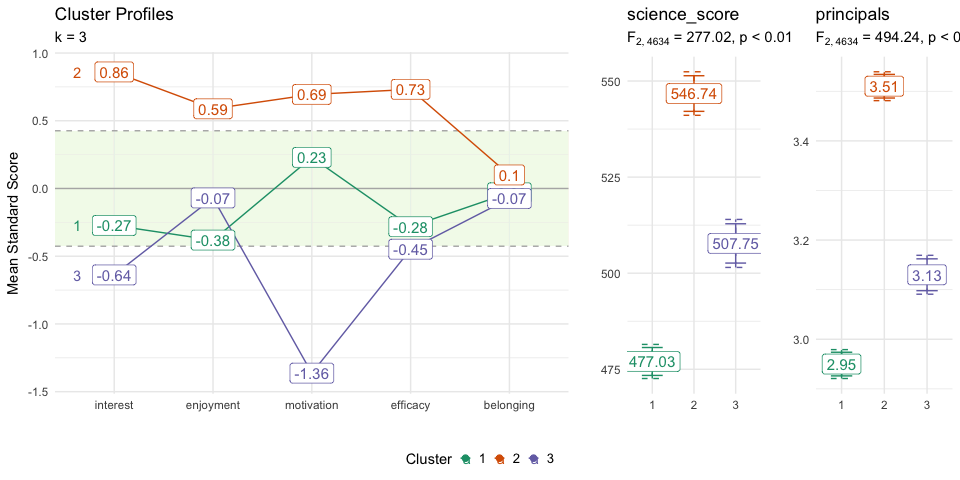

<!-- README.md is generated from README.Rmd. Please edit that file -->

# <a href='https://github.com/jbryer/clav'></a> Cluster Analysis Validation (`clav`)

<!-- badges: start -->

[](https://cran.r-project.org/package=clav)
[](https://github.com/jbryer/clav)
[](https://github.com/jbryer/clav/actions)
<!-- badges: end -->

The `clav` package provides utilities for conducting cluster (profile)
analysis with an emphasis on the validating the stability of the
profiles both within a given data set as well as across data sets.
Unlike supervised models where the known class is measured, validation
of unsupervised models where there is no known class can be challenging.
The approach implemented here attempts to compare the cluster results
across many random samples.

## Installation

You can install the development version of clav like so:

``` r
remotes::install_github('jbryer/clav')
```

## Development

The following commands are useful for working with the package source
locally.

``` r
# Prep the PISA data set. This will take a while to run the first time.
source('data-raw/data-prep-pisa-2015.R')
# Generate the package documentation
usethis::use_tidy_description()
devtools::document()
# Install the package
devtools::install()
# Run CRAN check for any issues
devtools::check(cran = TRUE)
# Build the pkgdown site
pkgdown::build_site()
```

## Example

``` r
library(clav)
data(pisa2015, package = 'clav')

cluster_vars <- c('interest', 'enjoyment', 'motivation', 'efficacy', "belonging")
outcome_vars <- c('science_score', 'principals')

pisa_usa <- pisa2015 |> dplyr::filter(country == 'UNITED STATES')
```

Finding the optimal number of clusters.

``` r
optimal <- optimal_clusters(pisa_usa[,cluster_vars], max_k = 5)
optimal
#>   k      wss silhoutte       gap calinski_harabasz davies_bouldin
#> 1 1 22099.00        NA 0.9204865               NaN            NaN
#> 2 2 17389.55 0.2004559 0.8978032         1255.2531       1.921547
#> 3 3 15576.01 0.2090841 0.8873620          970.3241       2.140642
#> 4 4 13853.12 0.1648447 0.8739126          892.9079       1.806862
#> 5 5 12598.94 0.1635484 0.8691637          871.9466       1.699252
plot(optimal, ncol = 2)
```


Validating cluster profiles using random samples of 50%. Out-of-bag uses
the remaining 50% to predict cluster membership.

``` r
pisa_cv_random <- pisa_usa |> 
    dplyr::select(dplyr::all_of(cluster_vars)) |>
    clav::cluster_validation(
        n_clusters = 3,
        sample_size = 0.5 * nrow(pisa_usa),
        replace = FALSE,
        n_samples = 100,
        seed = 42
)
plot(pisa_cv_random)
```


Re-estimate the clusters using the OOB sample instead of predicting
using the in sample model.

``` r
pisa_cv_random2 <- pisa_usa |> 
    dplyr::select(dplyr::all_of(cluster_vars)) |>
    clav::cluster_validation(
        n_clusters = 3,
        oob_predict_fun = function(fit, newdata) {
            newfit <- stats::kmeans(newdata, 3)
            newfit$cluster
        },
        sample_size = 0.5 * nrow(pisa_usa),
        replace = FALSE,
        n_samples = 100,
        seed = 42
)
plot(pisa_cv_random2)
```


Bootstrap approach to validation.

``` r
pisa_cv_bootstrap <- pisa_usa |> 
    dplyr::select(dplyr::all_of(cluster_vars)) |>
    clav::cluster_validation(
        n_clusters = 3,
        sample_size = nrow(pisa_usa),
        replace = TRUE,
        n_samples = 100,
        seed = 42
)
summary(pisa_cv_bootstrap)
#>    cluster   variable        mean         sd      median        min        max
#> 1        A   interest -0.08545563 0.20794006 -0.01933662 -0.7085601  0.1756677
#> 4        A  enjoyment -0.82595260 0.93295509 -0.47238507 -3.1832509 -0.1378171
#> 7        A motivation  0.03438512 0.13848631  0.04202484 -0.3702120  0.3128139
#> 10       A   efficacy  0.22793930 0.17151936  0.25302168 -0.7450277  0.4632471
#> 13       A  belonging -0.08787665 0.33172877 -0.15536938 -0.6198269  0.8427933
#> 2        B   interest -0.77781817 0.13470049 -0.79356880 -1.1098718 -0.2012293
#> 5        B  enjoyment -0.19003611 0.08495774 -0.17601959 -0.3800183  0.2629638
#> 8        B motivation -0.72126670 0.12218609 -0.73539262 -1.1790126 -0.4159184
#> 11       B   efficacy -0.85402196 0.17709644 -0.92111142 -1.0705855  0.1688400
#> 14       B  belonging -0.12698507 0.20377914 -0.06562988 -1.0687382  0.2060398
#> 3        C   interest  0.74539433 0.08386459  0.77098351  0.5343869  0.8885871
#> 6        C  enjoyment  0.68755697 0.13238031  0.73514008  0.3191332  0.8467393
#> 9        C motivation  0.67002226 0.12259974  0.65854879  0.4400497  0.9215403
#> 12       C   efficacy  0.55487637 0.07128235  0.53527944  0.4418459  0.7568697
#> 15       C  belonging  0.25402569 0.18965134  0.29326390 -0.1399515  0.5487877
#>        range          se
#> 1  0.8842278 0.020794006
#> 4  3.0454338 0.093295509
#> 7  0.6830259 0.013848631
#> 10 1.2082748 0.017151936
#> 13 1.4626202 0.033172877
#> 2  0.9086425 0.013470049
#> 5  0.6429820 0.008495774
#> 8  0.7630942 0.012218609
#> 11 1.2394255 0.017709644
#> 14 1.2747780 0.020377914
#> 3  0.3542002 0.008386459
#> 6  0.5276060 0.013238031
#> 9  0.4814906 0.012259974
#> 12 0.3150238 0.007128235
#> 15 0.6887392 0.018965134
plot(pisa_cv_bootstrap)
```


Using latent profile analysis for estimating clusters.

``` r
library(tidyLPA)
lpa <- pisa_usa |> 
    dplyr::select(dplyr::all_of(cluster_vars)) |>
    tidyLPA::estimate_profiles(3)
# lpa_predict <- predict(lpa, pisaUSA15[sample(nrow(pisaUSA15), 100),])
# lpa_estimates <- get_estimates(lpa)
lpa_data <- get_data(lpa)

plot_profiles(lpa)
clav::profile_plot(pisaUSA15,
             clusters = lpa_data$Class)

lpa_cv_random <- cluster_validation(
    pisaUSA15,
    n_clusters = 3,
    cluster_fun = estimate_profiles,
    oob_predict_fun = function(fit, newdata) {
        estimate_profiles(newdata, n_clusters)
    },
    sample_size = 0.5 * nrow(pisaUSA15),
    replace = FALSE,
    n_samples = 50,
    seed = 42
)
plot(lpa_cv_random)
```

## Profile Plot

``` r
fit <- pisa_usa |> 
    dplyr::select(dplyr::all_of(cluster_vars)) |>
    stats::kmeans(centers = 3)
clav::profile_plot(pisa_usa[,cluster_vars],
                   clusters = fit$cluster,
                   df_dep = pisa_usa[,outcome_vars],
                   center_band = 0.33,
                   cluster_order = cluster_vars)
```


