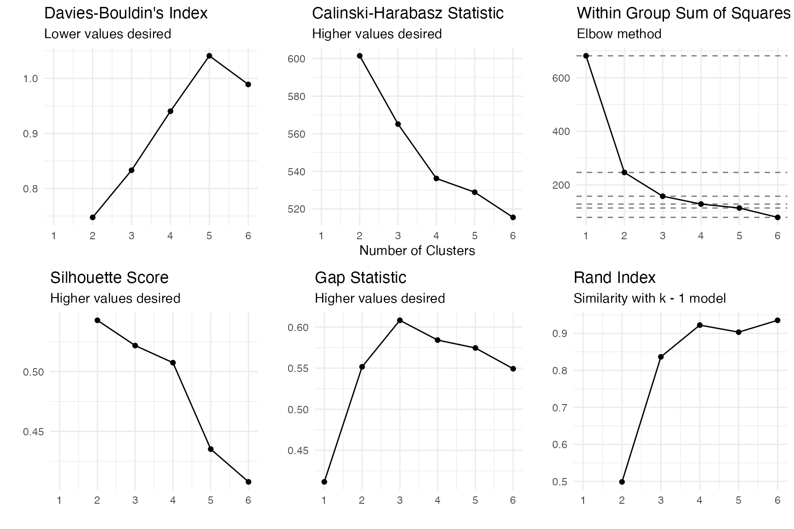
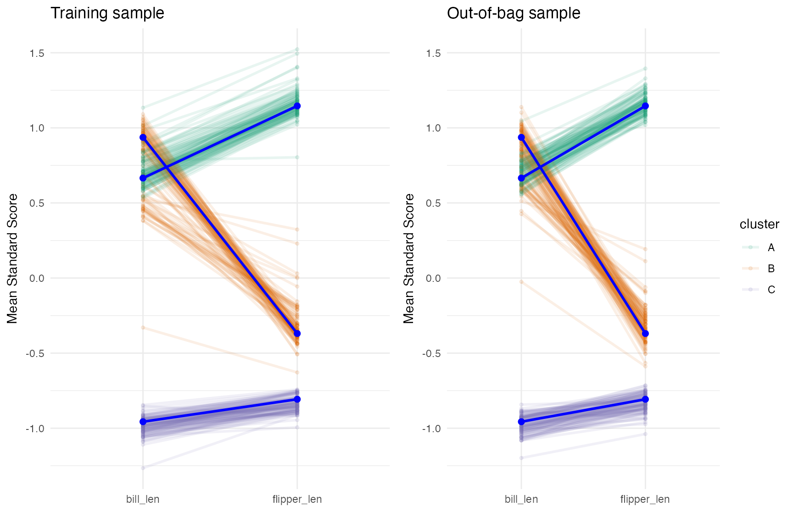
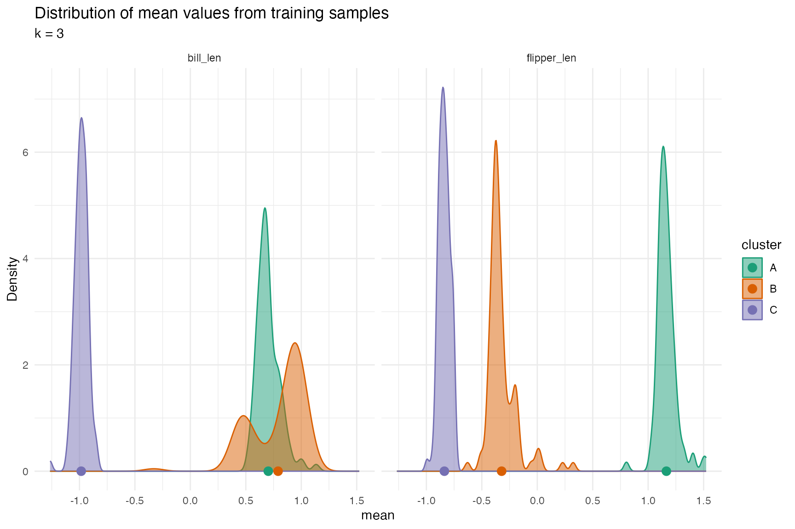
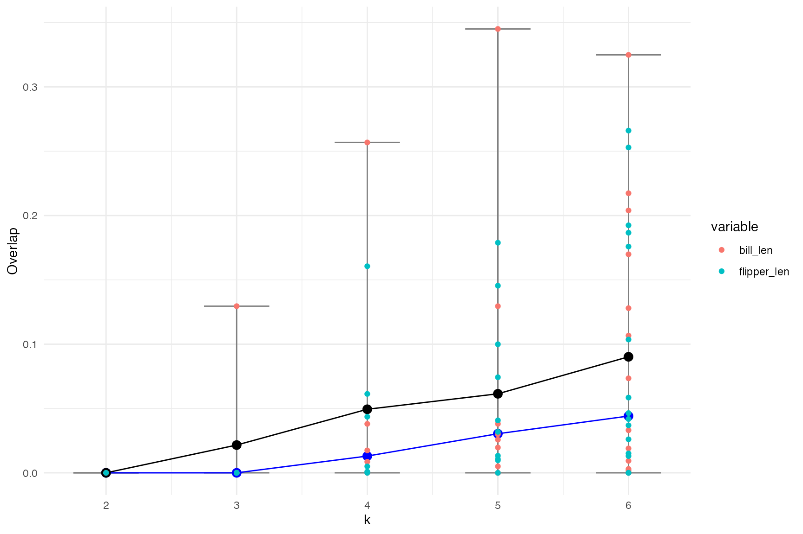

# Bootstrap Overlap Fit for Determining the Optimal Number of Clusters

Data preparation…

``` r
data(penguins, package = 'datasets')
cluster_vars <- c('bill_len', 'flipper_len')
penguins <- penguins[complete.cases(penguins[,cluster_vars]),] # Two observations with missing values
```

Standardize our two clustering variables…

``` r
penguins <- penguins |>
    dplyr::mutate(dplyr::across(all_of(cluster_vars), clav::scale_this))
```

Clearly there are three clusters…

``` r
ggplot(penguins, aes(x = bill_len, flipper_len, color = species)) +
    geom_point()
```


What do some common metrics suggest?

``` r
oc <- clav::optimal_clusters(penguins[,cluster_vars], max_k = 6)
plot(oc)
```



- Davies-Bouldin’s Index: 2
- Calinski-Harabasz Statistic: 2
- Within sum of squares: 3
- Silhouette score: 2
- Gap statistic: 3
- Rand Index: 4

Two of the six metric suggest the actual number of clusters of three.

As describe [here](https://jbryer.github.io/clav/articles/clav.html) the
cluster validation uses a bootstrap (or bootstrap like approach) to
determine if the clusters are consistent across all the samples. If one
of the goals of clustering is for the centers of each cluster to be as
far apart from one another as possible, we can use the distributions of
cluster means to compare how much they overlap across all bootstrap
samples.

Let’s consider the known optimal number of clusters where *k* = 3.

``` r
km_out <- stats::kmeans(penguins[,cluster_vars], centers = 3)
clusters <- km_out$cluster
cv <- clav::cluster_validation(df = penguins[,cluster_vars],
                               n_clusters = 3,
                               sample_size = nrow(penguins),
                               replace = TRUE,
                               verbose = FALSE)
plot(cv)
```



The profile plot above shows that there is pretty good separation, but
the separation between `bill_length_mm` between clusters B and C is the
smallest. We can see better when we plot the distributions.

``` r
plot_distributions(cv)
```



The following table calculates the percent overlap of the distribution
of the cluster centers between each cluster for each variable (TODO:
that is a wordy sentence).

``` r
cv$overlap
#>      variable C1 C2      overlap k
#> 1    bill_len  A  B 7.024145e-17 3
#> 2    bill_len  A  C 5.808049e-17 3
#> 3    bill_len  B  C 1.058899e-01 3
#> 4 flipper_len  A  B 1.202858e-11 3
#> 5 flipper_len  A  C 5.576264e-17 3
#> 6 flipper_len  B  C 9.607188e-04 3
```

The following function will call `cluster_validation` and save the
cluster overlap.

``` r
#'
#' Note: This will use bootstrapping.
overlap_fits <- function(
        df,
        k = 2:6,
        verbose = interactive(),
        ...
) {
    overlap <- data.frame()
    for(i in k) {
        if(verbose) { message(paste0('Estimating for k = ', i)) }
        cv <- clav::cluster_validation(df = df,
                                       n_clusters = i,
                                       sample_size = nrow(df),
                                       replace = TRUE,
                                       verbose = verbose,
                                       ...)
        overlap <- rbind(overlap, cv$overlap)
    }
    return(overlap)
}
```

Now let’s try this for *k* equal to 2 through 6 clusters.

``` r
overlap <- overlap_fits(df =  penguins[,cluster_vars])
```

The figure below shows the mean (in black) and median (in blue) overlap.
The individual points correspond to the overlap for each variable and
cluster combination (colored by the variable). Couple of observations
from this plot:

- It suggests that *k* = 3 is the probably the best (well technically 2
  but the median difference when *k* = 3 is the same).
- If there is a large overlap between clusters it is with the
  `bill_length_mm` variable.

``` r
overlap_sum <- overlap |>
    dplyr::group_by(k) |>
    dplyr::summarize(mean_overlap = mean(overlap),
                     median_overlap = median(overlap),
                     min_overlap = min(overlap),
                     max_overlap = max(overlap))
ggplot(overlap_sum, aes(x = k, y = mean_overlap)) +
    geom_errorbar(aes(ymin = min_overlap, ymax = max_overlap), width = 0.5, color = 'grey50') +
    geom_path() +
    geom_path(aes(y = median_overlap), color = 'blue') +
    geom_point(aes(y = median_overlap), color = 'blue', size = 3) +
    geom_point(size = 3) +
    geom_point(data = overlap, aes(x = k, y = overlap, color = variable)) +
    ylab('Overlap')
```


