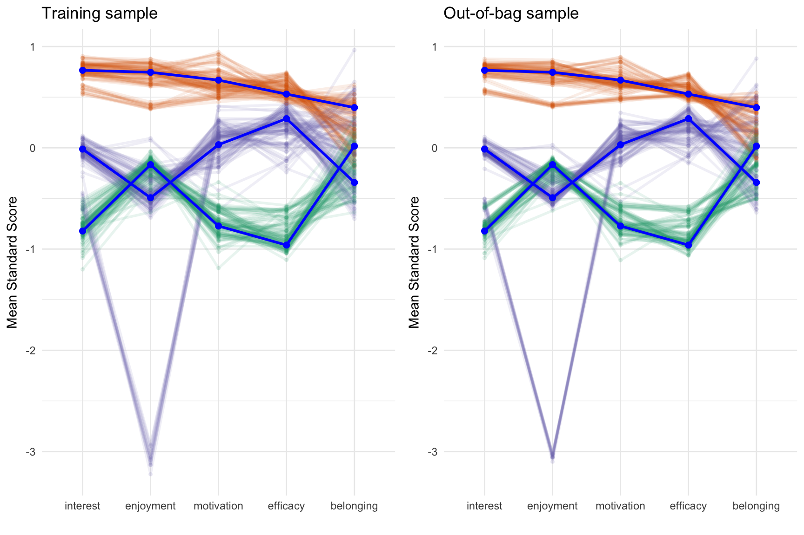
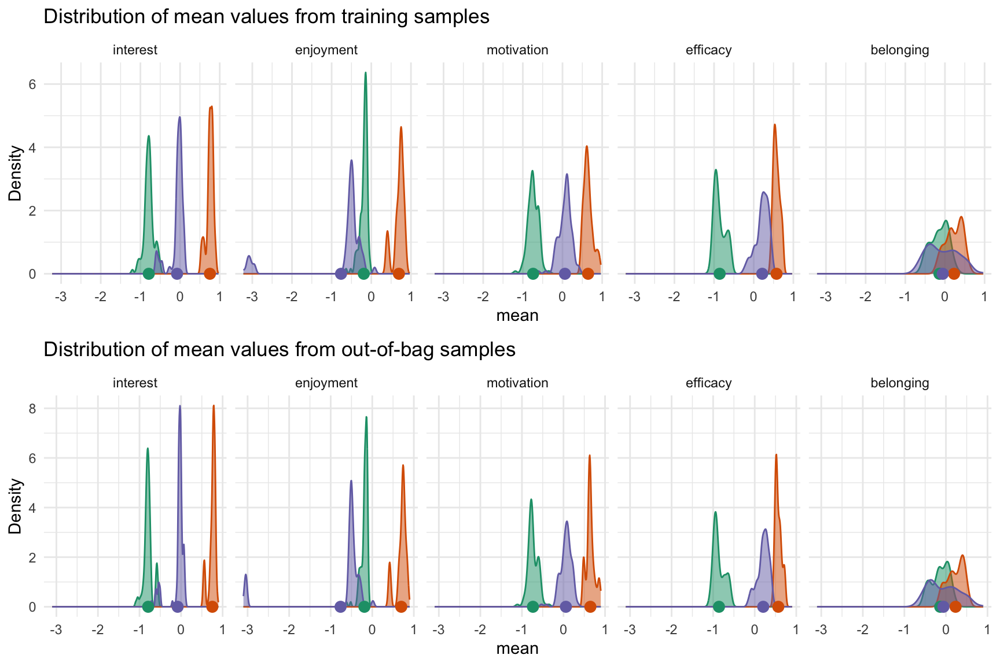
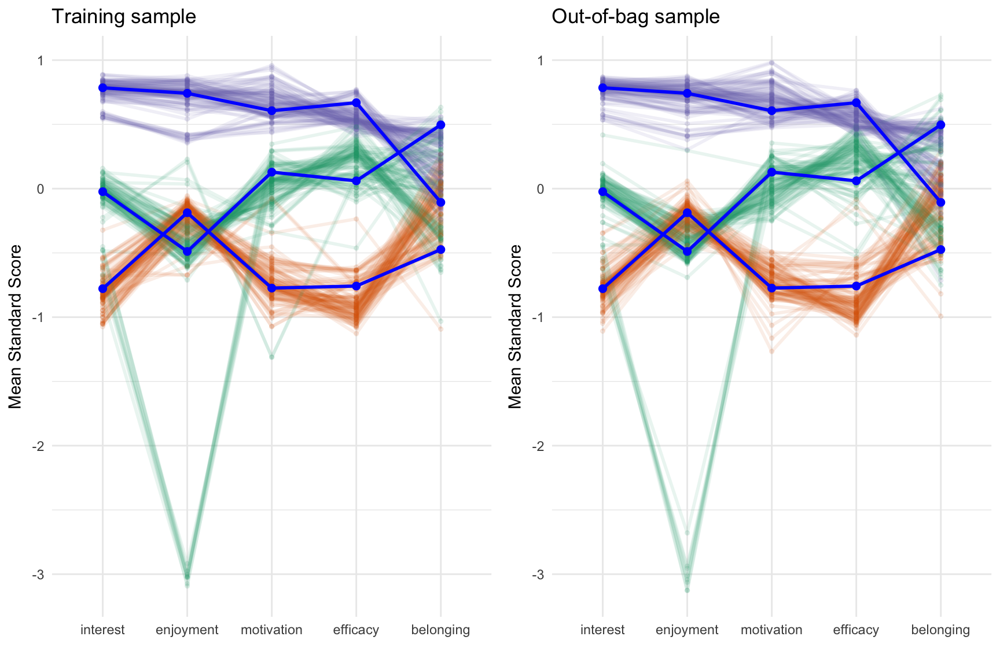

# Cluster Analysis Validation

## Abstract

Cluster analysis is a statistical procedure for grouping observations
using an observation-centered approach as compared to variable-centric
approaches (e.g. PCA, factor analysis). Whether a preprocessing step for
predictive modeling or the primary analysis, validation is critical for
determining generalizability across datasets. Theodoridis and
Koutroumbas (2008) identified three broad types of validation for
cluster analysis: 1) Internal cluster validation, 2) Relative cluster
validation, and 3) External cluster validation. Strategies for steps 1
and 2 are well established, however cluster analysis is typically an
unsupervised learning method where there is no observed outcome. Ullman
et al (2021) proposed an approach to validating a cluster solution by
visually inspecting the cluster solutions across a training and
validation dataset. This paper introduces the `clav` R package that
implements and expands this approach by generating multiple random
samples (using either a simple random split or bootstrap samples).
Visualizations of both the cluster profiles as well as distributions of
the cluster means are provided along with a Shiny application to assist
the researcher.

## Introduction

### Data source

The [Programme for International Student
Assessment](http://pisa.oecd.org/) (PISA) is large scale study conducted
by the [Organisation for Economic Co-operation and
Development](https://www.oecd.org) (OECD) every three years designed to
measure 15-year-olds’ reading, mathematics, and science skill. In
addition to measuring academic skills, students complete questionnaires
on other areas including motivation, self-efficacy, interest, among
other demographics. This study uses data from the 2015 administration in
the United States. Cluster analysis will be performed on student
interest, motivation, and self-efficacy and we will explore how these
variables are related to two dependent variables: science skills and
self-reported knowledge of science principals (see Appendix A for items
that inform these scales).

The `clav` package includes data for the United States and Canada, but
we will only use the United States here[^1].

``` r
library(clav)
data(pisa2015, package = 'clav')

cluster_vars <- c('interest', 'enjoyment', 'motivation', 'efficacy', 'belonging')
outcome_vars <- c('science_score', 'principals')

pisa_usa <- pisa2015 |> 
    dplyr::filter(country == 'UNITED STATES') |>
    dplyr::mutate(dplyr::across(dplyr::all_of(cluster_vars), clav::scale_this))
```

### Variable centric analysis

``` r
science_lm_out <- lm(
    science_score ~ interest + enjoyment + motivation + efficacy + belonging,
    data = pisa_usa)
summary(science_lm_out)
#> 
#> Call:
#> lm(formula = science_score ~ interest + enjoyment + motivation + 
#>     efficacy + belonging, data = pisa_usa)
#> 
#> Residuals:
#>      Min       1Q   Median       3Q      Max 
#> -274.168  -58.914    1.114   60.446  271.258 
#> 
#> Coefficients:
#>             Estimate Std. Error t value Pr(>|t|)    
#> (Intercept)  506.398      1.226 413.173  < 2e-16 ***
#> interest      15.938      1.407  11.325  < 2e-16 ***
#> enjoyment     23.511      1.283  18.318  < 2e-16 ***
#> motivation    -8.043      1.318  -6.104 1.12e-09 ***
#> efficacy      16.767      1.326  12.646  < 2e-16 ***
#> belonging     -1.609      1.231  -1.308    0.191    
#> ---
#> Signif. codes:  0 '***' 0.001 '**' 0.01 '*' 0.05 '.' 0.1 ' ' 1
#> 
#> Residual standard error: 83.46 on 4631 degrees of freedom
#> Multiple R-squared:  0.1759, Adjusted R-squared:  0.175 
#> F-statistic: 197.7 on 5 and 4631 DF,  p-value: < 2.2e-16
```

``` r
principals_lm_out <- lm(
    science_score ~ interest + enjoyment + motivation + efficacy + belonging,
    data = pisa_usa)
summary(principals_lm_out)
#> 
#> Call:
#> lm(formula = science_score ~ interest + enjoyment + motivation + 
#>     efficacy + belonging, data = pisa_usa)
#> 
#> Residuals:
#>      Min       1Q   Median       3Q      Max 
#> -274.168  -58.914    1.114   60.446  271.258 
#> 
#> Coefficients:
#>             Estimate Std. Error t value Pr(>|t|)    
#> (Intercept)  506.398      1.226 413.173  < 2e-16 ***
#> interest      15.938      1.407  11.325  < 2e-16 ***
#> enjoyment     23.511      1.283  18.318  < 2e-16 ***
#> motivation    -8.043      1.318  -6.104 1.12e-09 ***
#> efficacy      16.767      1.326  12.646  < 2e-16 ***
#> belonging     -1.609      1.231  -1.308    0.191    
#> ---
#> Signif. codes:  0 '***' 0.001 '**' 0.01 '*' 0.05 '.' 0.1 ' ' 1
#> 
#> Residual standard error: 83.46 on 4631 degrees of freedom
#> Multiple R-squared:  0.1759, Adjusted R-squared:  0.175 
#> F-statistic: 197.7 on 5 and 4631 DF,  p-value: < 2.2e-16
```

## Finding the desired number of clusters

``` r
optimal <- optimal_clusters(pisa_usa[,cluster_vars], max_k = 6)
optimal
#>   k      wss silhoutte       gap calinski_harabasz davies_bouldin rand_index
#> 1 1 23180.00        NA 0.9077290               NaN            NaN         NA
#> 2 2 18221.06 0.2003285 0.8881730         1261.4359       1.916861  0.5015503
#> 3 3 16348.24 0.2085359 0.8738598          965.0861       2.152198  0.6832980
#> 4 4 14588.79 0.1621539 0.8655373          908.7634       1.819800  0.8098577
#> 5 5 13318.75 0.1684867 0.8602912          869.9972       1.809378  0.7366672
#> 6 6 12223.82 0.1718593 0.8715511          826.2544       1.634673  0.7914534
```

- [Davies-Bouldin
  Index](https://ieeexplore.ieee.org/document/4766909) (1979) - DBI is a
  metric used to evaluate the quality of a cluster analysis by measuring
  the compactness of clusters and their separation from each other. A
  lower DBI indicates better clustering, with well-separated and compact
  clusters.

- [Calinski-Harabasz
  Statistic](https://www.tandfonline.com/doi/abs/10.1080/03610927408827101)
  (Caliński & Harabasz, 1974) - CH statistic measures the ratio of
  between-cluster variance to within-cluster variance, indicating how
  well-separated and compact the clusters are. Higher CH values
  generally indicate better clustering performance.

- [Within group sum of
  squares](https://www.cambridge.org/core/journals/psychometrika/article/abs/who-belongs-in-the-family/5270D9B37A258A06C7CE7C0A528145F5)
  (Thorndike, 1953) - WSS quantifies the dispersion of data points
  within each cluster, with lower WSS values indicating more compact and
  well-defined clusters.

- [Silhoutte
  score](https://www.sciencedirect.com/science/article/pii/0377042787901257?via%3Dihub)
  (Rousseeuw, 1986) - The silhouette value is a measure of how similar
  an object is to its own cluster (cohesion) compared to other clusters
  (separation). The silhouette value ranges from −1 to +1, where a high
  value indicates that the object is well matched to its own cluster and
  poorly matched to neighboring clusters.

- [Gap
  statistic](https://academic.oup.com/jrsssb/article-abstract/63/2/411/7083348?redirectedFrom=fulltext&login=false)
  (Tibshirani, Walther, & Hastie, 2001) - The Gap statistic works by
  comparing the within-cluster variation of the actual data to that of a
  null reference distribution, typically a uniform distribution. The
  *gap* is the difference between these two, and the optimal number of
  clusters is chosen where the gap statistic is maximized.

- [Rand
  index](https://www.tandfonline.com/doi/abs/10.1080/01621459.1971.10482356) (2012) -
  The Rand index measures how often pairs of data points are assigned to
  the same or different clusters in both partitions. A higher Rand Index
  indicates greater similarity between the two clusterings.

``` r
plot(optimal, ncol = 2)
```


## Validating cluster solution

One of the biggest challenges of estimating unsupervised models is
determining the accuracy of the model given that in most instances there
is now know, or observed, outcome. Since we cannot compare model outputs
with a know value, we instead look for stability of model estimates
across multiple samples. Ullman et al (2021) proposed splitting data and
visually comparing the cluster profiles across the two samples. The
`clav` package extends this idea by implementing an algorithm where many
samples are drawn, cluster membership is estimated with a training
dataset, and cluster membership for the out-of-bag sample is predicted.
We can then use a number of visualizations to determine the stability of
the profiles across many random samples.

The `cluster_validation` function implements this algorithm. The default
will estimate 100 cluster models (using the K-means cluster, but other
methods can be specified using the `cluster_fun` parameter). For each
iteration, 50% of the observations will be randomly selected (the
training size can be modified using the `sample_size` parameter) and the
cluster model will be estimated. Cluster membership will then be
predicted using this model for the other 50% of observations. A cluster
model will also be estimated using the full dataset. The figure below
shows the cluster profiles for 100 samples for the training data on the
left and for the out-of-bag sample on the right (the paths are color
coded by cluster membership). The cluster profile using the full dataset
is represented by the blue line. For each path the mean of each variable
grouped by cluster membership is plotted. In this example we can see
that there is one cluster that is above average across all the variables
(green lines). The other two clusters are a bit mixed with the orange
lines indicating that there is a cluster that is generally below average
with the exception belonging and interest which are near the mean. The
purple lines represent a cluster that is generally nearly normal across
all variables. These plots are not intended to assist in interpreting
clusters (that will be discussed in a later section), but instead
determine if there is stability in the cluster estimates across many
samples.

``` r
cv <- cluster_validation(
    pisa_usa[,cluster_vars],
    n_clusters = 3)
plot(cv)
```



The figure below provides an alternative approach for determining
stability by plotting the distribution of means across clusters and
variables. Ideally we would want the standard deviation of these
distributions to be as small as possible.

``` r
plot_distributions(cv, plot_in_sample = TRUE, plot_oob_sample = TRUE)
```



### Bootstrapping

``` r
cv_boot <- cluster_validation(
    pisa_usa[,cluster_vars],
    n_clusters = 3,
    sample_size = nrow(pisa_usa),
    replace = TRUE)
plot(cv_boot)
```


### Retraining

``` r
cv_retrain <- cluster_validation(
    pisa_usa[,cluster_vars],
    n_clusters = 3,
    oob_predict_fun = function(fit, newdata) {
        stats::kmeans(newdata, 3)$cluster
    }
)
plot(cv_retrain)
```



## Analyzing dependent variables

### Profile plots

``` r
fit <- stats::kmeans(pisa_usa[,cluster_vars], centers = 3)
profile_plot(pisa_usa[,cluster_vars],
             clusters = fit$cluster,
             df_dep = pisa_usa[,outcome_vars],
             cluster_order = cluster_vars)
```


### Using clusters in regression analysis

``` r
kmeans_out <- stats::kmeans(pisa_usa[,cluster_vars], 3)
pisa_usa$cluster <- kmeans_out$cluster
lm_out <- lm(science_score ~ interest + enjoyment + motivation + efficacy + belonging + cluster,
             data = pisa_usa)
summary(lm_out)
#> 
#> Call:
#> lm(formula = science_score ~ interest + enjoyment + motivation + 
#>     efficacy + belonging + cluster, data = pisa_usa)
#> 
#> Residuals:
#>      Min       1Q   Median       3Q      Max 
#> -275.325  -58.953    2.182   59.072  272.494 
#> 
#> Coefficients:
#>             Estimate Std. Error t value Pr(>|t|)    
#> (Intercept)  527.086      4.173 126.307  < 2e-16 ***
#> interest      17.467      1.434  12.180  < 2e-16 ***
#> enjoyment     21.286      1.350  15.768  < 2e-16 ***
#> motivation    -6.969      1.330  -5.239 1.69e-07 ***
#> efficacy      20.392      1.496  13.634  < 2e-16 ***
#> belonging     -3.187      1.264  -2.521   0.0117 *  
#> cluster       -9.808      1.892  -5.185 2.25e-07 ***
#> ---
#> Signif. codes:  0 '***' 0.001 '**' 0.01 '*' 0.05 '.' 0.1 ' ' 1
#> 
#> Residual standard error: 83.23 on 4630 degrees of freedom
#> Multiple R-squared:  0.1806, Adjusted R-squared:  0.1796 
#> F-statistic: 170.1 on 6 and 4630 DF,  p-value: < 2.2e-16
```

## Discussion

### Shiny application

## References

Caliński, T., & Harabasz, J. (1974). A dendrite method for cluster
analysis. Communications in Statistics, 3(1), 1–27.
<https://doi.org/10.1080/03610927408827101>

Davies, D. L., & Bouldin, D.W. (1979). A cluster separation measure.
*IEEE Transactions on Pattern Analysis and Machine Intelligence. PAMI-1*
(2): 224–227. <https://doi.org/10.1109/TPAMI.1979.4766909>

Rand, W. M. (1971). Objective Criteria for the Evaluation of Clustering
Methods. *Journal of the American Statistical Association, 66*(336),
846–850. <https://doi.org/10.1080/01621459.1971.10482356>

Rousseeuw, P.J. (1986). Silhouettes: A graphical aid to the
interpretation and validation of cluster analysis. *Journal of
Computational and Applied Mathematics* (20): 53-65.
<https://doi.org/10.1016/0377-0427(87)90125-7>

Theodoridis, S., & Koutroumbas, K. (2008). *Pattern Recognition, Fourth
Edition.* Academic Press, Inc.

Thorndike, R. L. (1953). Who Belongs in the Family? Psychometrika,
18(4), 267–276. <https://doi.org/10.1007/BF02289263>

Tibshirani, R., Walther, G., & Hastie, T. (2001) Estimating the number
of clusters in a data set via the gap statistic. *Journal of the Royal
Statistical Society Series B: Statistical Methodology, 63*(2), 411–423,
<https://doi.org/10.1111/1467-9868.00293>

Ullmann, T., Hennig, C., & Boulesteix, A.-L. (2022). Validation of
cluster analysis results on validation data: A systematic framework.
WIREs Data Mining and Knowledge Discovery, 12(3), e1444.
<https://doi.org/10.1002/widm.1444>

## Appendix A: Student Questionaire Items and Scales

**Belonging**: Thinking about your school: to what extent do you agree
with the following statements? (`ST034`)

- I feel like an outsider (or left out of things) at school.
- I make friends easily at school.
- I feel like I belong at school.
- I feel awkward and out of place in my school.
- Other students seem to like me.
- I feel lonely at school.

**Interest**: How much do you disagree or agree with the statements
about yourself below? (`ST094`)

- I generally have fun when I am learning broad science topics.
- I like reading about broad science.
- I am happy working on broad science topics.
- I enjoy acquiring new knowledge in broad science.
- I am interested in learning about broad science.

**Enjoyment**: How much do you disagree or agree with the statements
about yourself below? (`ST094`)

- I generally have fun when I am learning broad science topics.
- I like reading about broad science.
- I am happy working on broad science topics.
- I enjoy acquiring new knowledge in broad science.
- I am interested in learning about broad science.

**Motivation**: How much do you agree with the statements below?
(`ST113`)

- Making an effort in my school science subject(s) is worth it because
  this will help me in the work I want to do later on.
- What I learn in my school science subject(s) is important for me
  because I need this for what I want to do later on.
- Studying my school science subject(s) is worthwhile for me because
  what I learn will improve my career prospects.
- Many things I learn in my school science subject(s) will help me to
  get a job.

**Efficacy**: How easy do you think it would be for you to perform the
following tasks on your own? (`ST129`)

- Recognize the science question that underlies a newspaper report on a
  health issue.
- Explain why earthquakes occur more frequently in some areas than in
  others.
- Describe the role of antibiotics in the treatment of disease.
- Identify the science question associated with the disposal of garbage.
- Predict how changes to an environment will affect the survival of
  certain species.
- Interpret the scientific information provided on the labelling of food
  items.
- Discuss how new evidence can lead you to change your understanding
  about the possibility of life on Mars.
- Identify the better of two explanations for the formation of acid
  rain.

**Principals**: How much do you disagree or agree with the statements
below? (`ST131`)

- A good way to know if something is true is to do an experiment.
- Ideas in broad science sometimes change.
- Good answers are based on evidence from many different experiments.
- It is good to try experiments more than once to make sure of your
  findings.
- Sometimes broad science scientists change their minds about what is
  true in science.
- The ideas in broad science science books sometimes change.

[^1]: The R script to prepare this data file is available here:
    <https://github.com/jbryer/clav/blob/master/data-raw/data-prep-pisa-2015.R>
    which allows for easy modification to include other countries.
