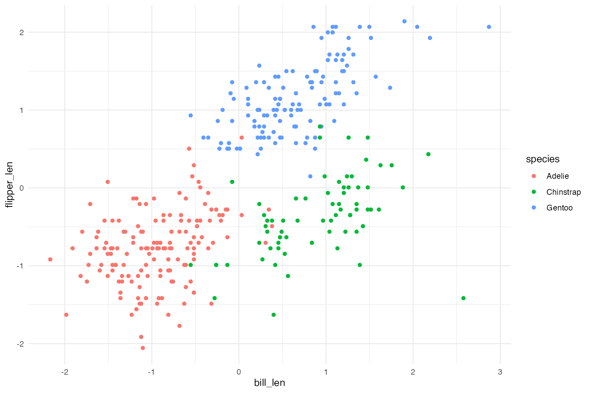
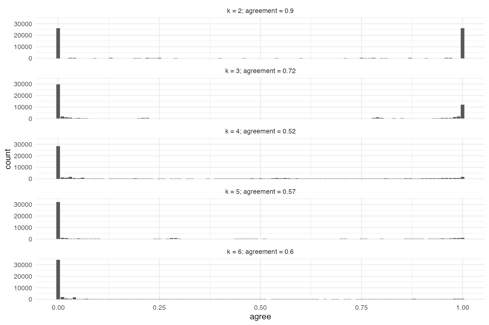

# Cluster Agreement Fit Statistic

Data preparation…

``` r
data(penguins, package = 'datasets')
cluster_vars <- c('bill_len', 'flipper_len')
penguins <- penguins[complete.cases(penguins[,cluster_vars]),] # Two observations with missing values
```

Standardize our two clustering variables…

``` r
penguins <- penguins |>
    dplyr::mutate(dplyr::across(all_of(cluster_vars), clav::scale_this))
```

Clearly there are three clusters…

``` r
ggplot(penguins, aes(x = bill_len, flipper_len, color = species)) +
    geom_point()
```



The [`cluster_agreement_fit()`](../reference/cluster_agreement_fit.md)
function will call the
[`cluster_validation()`](../reference/cluster_validation.md) function
for varying number of clusters (i.e. k, default will be 2 to 6).
Additionally, it will calculate the overlap in cluster membership for
each pair of observations.

``` r
penguins_caf <- cluster_agreement_fit(penguins[,cluster_vars] )
```

``` r
summary(penguins_caf)
#>    k       fit
#> k2 2 0.9085593
#> k3 3 0.6594468
#> k4 4 0.5308775
#> k5 5 0.5177239
#> k6 6 0.6003841
```

``` r
plot(penguins_caf)
```


``` r
hist(penguins_caf)
```


