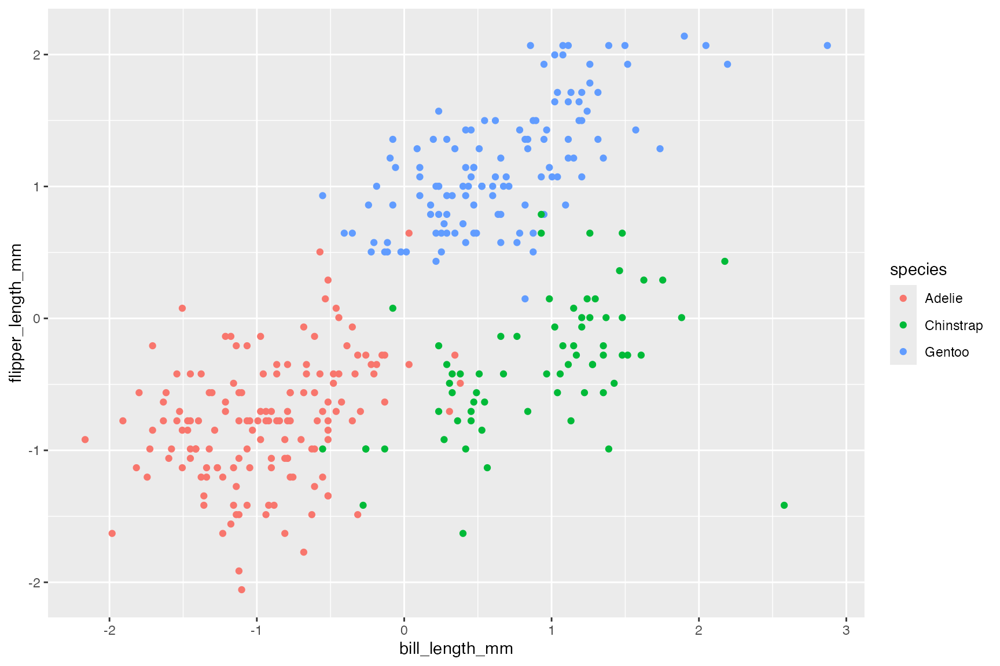

# Clustering Overlap Metric for Determining the Optimal Number of Clusters

Data preparation…

``` r
<<<<<<< HEAD
data(penguins, package = 'datasets')
cluster_vars <- c('bill_len', 'flipper_len')
=======
data(penguins, package = 'palmerpenguins')
cluster_vars <- c('bill_length_mm', 'flipper_length_mm')
>>>>>>> ef5508e8c91389537f38a80a4378d7c8ac2e1fc8
penguins <- penguins[complete.cases(penguins[,cluster_vars]),] # Two observations with missing values
```

Standardize our two clustering variables…

``` r
penguins <- penguins |>
    dplyr::mutate(dplyr::across(all_of(cluster_vars), clav::scale_this))
```

Clearly there are three clusters…

``` r
<<<<<<< HEAD
ggplot(penguins, aes(x = bill_len, flipper_len, color = species)) +
    geom_point()
```



=======
`ggplot``(``penguins``, ``aes``(``x ``=`` ``bill_length_mm``, ``flipper_length_mm``, color ``=`` ``species``)``)`` ``+`` `` ``geom_point``(``)`
