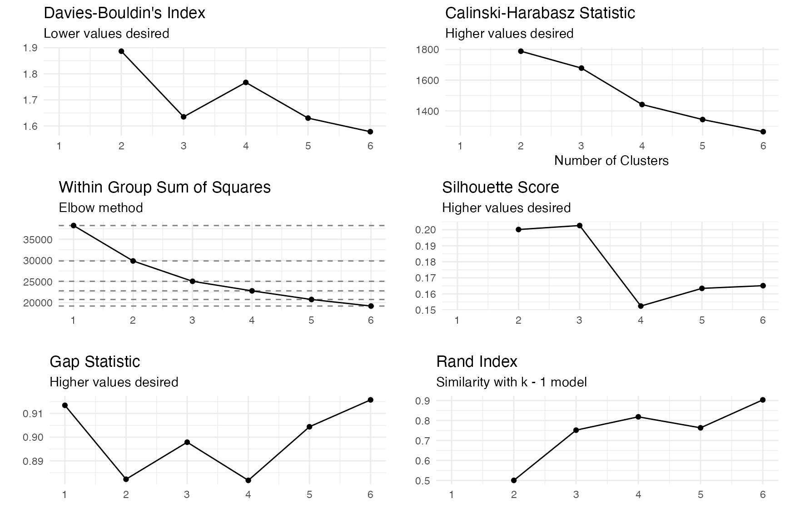
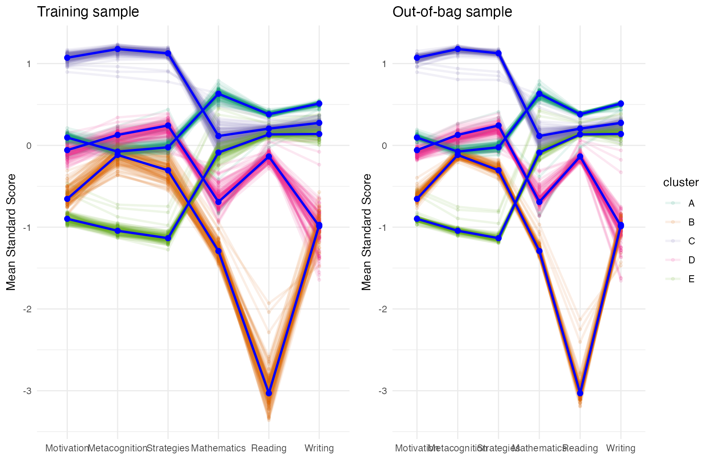
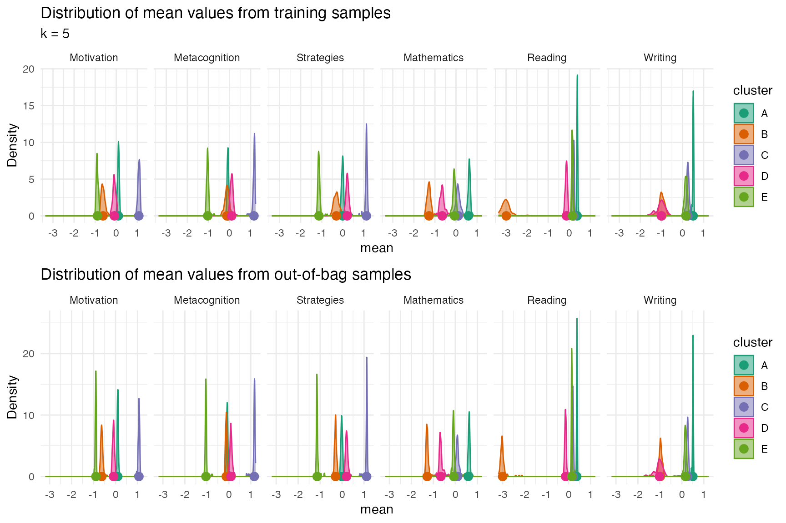
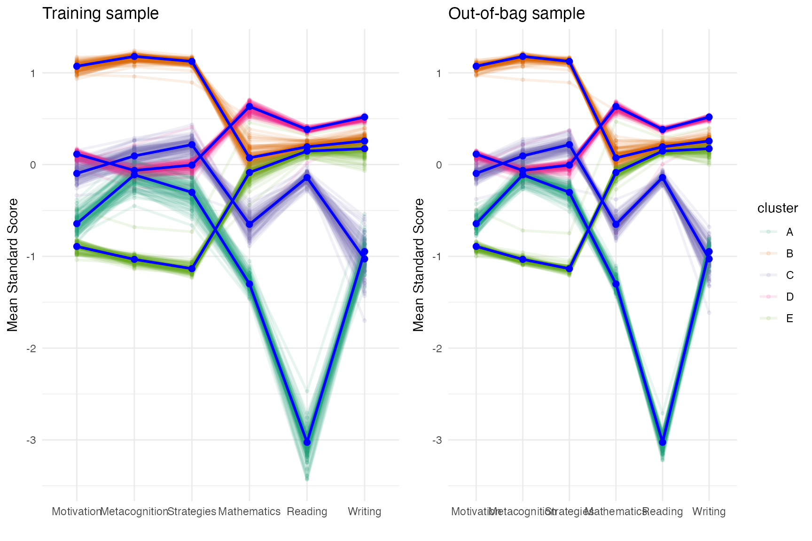
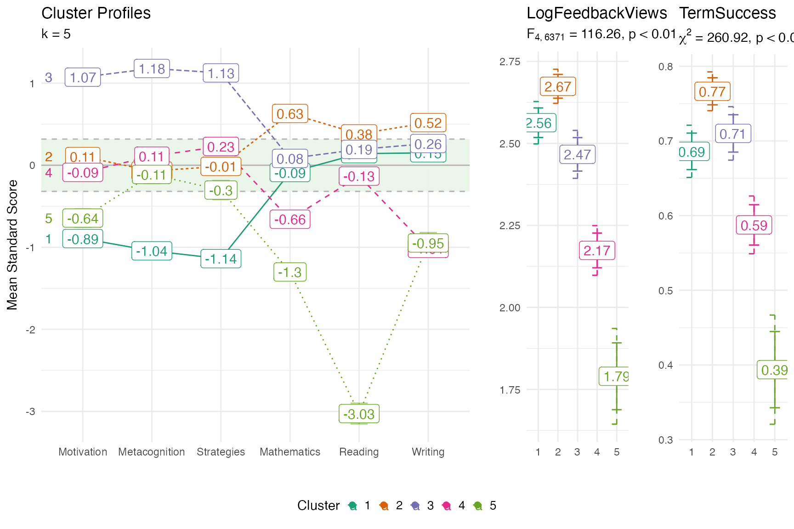

# College Readiness Profiles

This vignette outlines the analysis for the paper Identifying and
Distinguishing College Readiness Profiles Across Academic Outcomes: The
Importance of Integrating Academic Skills and Self-Regulated Learning by
Timothy J. Cleary, Jason Bryer, Elie ChingYen Yu presented at AERA 2025.

``` r
data(daacs)
cluster_vars <- c('Motivation', 'Metacognition', 'Strategies', 'Mathematics', 'Reading', 'Writing')
daacs <- daacs |>
    dplyr::mutate(LogFeedbackViews = log(daacs$FeedbackViews)) |>
    dplyr::mutate(dplyr::across(dplyr::all_of(cluster_vars), clav::scale_this))
```

## Finding the desired number of clusters

``` r
optimal <- optimal_clusters(daacs[,cluster_vars], max_k = 6)
optimal
#>   k      wss silhoutte       gap calinski_harabasz davies_bouldin rand_index
#> 1 1 38250.00        NA 0.9134492               NaN            NaN         NA
#> 2 2 29868.66 0.2001269 0.8822160          1788.585       1.886276  0.5002855
#> 3 3 25052.91 0.2025981 0.8978628          1678.549       1.634979  0.7516727
#> 4 4 22790.00 0.1524237 0.8817384          1441.386       1.766747  0.8183650
#> 5 5 20747.34 0.1634359 0.9043772          1343.563       1.630104  0.7633536
#> 6 6 19198.02 0.1651130 0.9157450          1264.325       1.578091  0.9032546
```

``` r
plot(optimal, ncol = 2)
```



## Validating cluster solution

``` r
cv <- cluster_validation(daacs[,cluster_vars],
                         n_clusters = 5)
plot(cv, facet = FALSE)
```



``` r
plot_distributions(cv, plot_in_sample = TRUE, plot_oob_sample = TRUE)
```



``` r
cv_boot <- cluster_validation(daacs[,cluster_vars],
                         n_clusters = 5,
                         sample_size = nrow(daacs),
                         replace = TRUE)
plot(cv_boot, facet = FALSE)
```



## Profile plots

``` r
fit <- stats::kmeans(daacs[,cluster_vars], centers = 5)
profile_plot(daacs[,cluster_vars],
             clusters = fit$cluster,
             df_dep = daacs[,c('LogFeedbackViews', 'TermSuccess')],
             cluster_order = cluster_vars)
```


