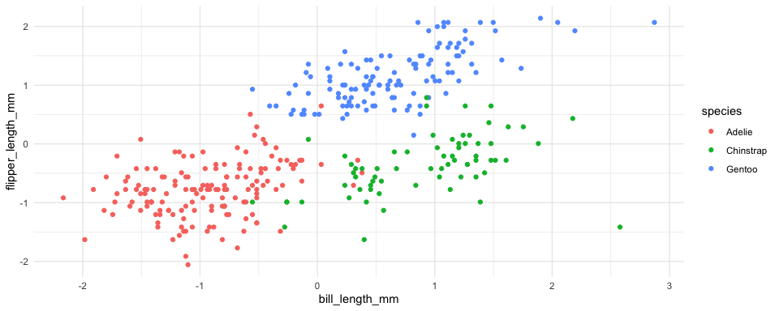
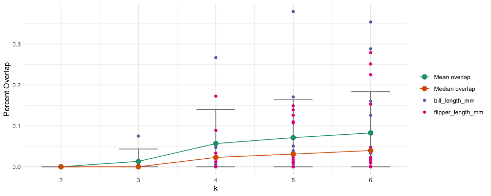
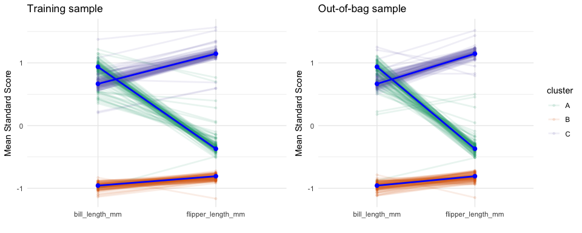
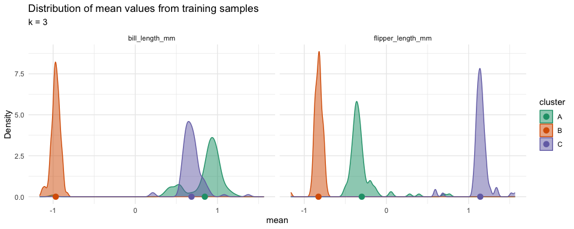

# Contributions to the field

Cluster analysis is a statistical procedure for grouping observations
using an observation- centered approach as compared to variable-centric
approaches (e.g. PCA, factor analysis). Whether as a preprocessing step
for predictive modeling or the primary analysis, validation is critical
for determining generalizability across datasets. The first step for
cluster analysis is determining the optimal number of clusters. Several
methods have been proposed to provide guidance on selecting the correct
number of classes (see Table 1), however there is often disagreement
between these methods. This paper proposes a new measure for determining
the optimal number of clusters using bootstrapping. In particular, this
approach estimates the distribution of cluster centers across all
variables from boostrap samples. The overlap of cluster distributions is
then calculated. The proposed visualizations provide insight not only
into the total overall but also which cluster and variable combinations
may not be well separated by the clustering model (k means cluster is
used here but is generalizable to other methods).

<table>
<caption>Commonly used metrics for determining the number of
clusters.</caption>
<colgroup>
<col style="width: 7%" />
<col style="width: 9%" />
<col style="width: 82%" />
</colgroup>
<thead>
<tr>
<th style="text-align: left;">Fit_Statistic</th>
<th style="text-align: left;">Reference</th>
<th style="text-align: left;">Description</th>
</tr>
</thead>
<tbody>
<tr>
<td style="text-align: left;">Davies-Bouldin Index</td>
<td style="text-align: left;">Davies &amp; Bouldin, 1979</td>
<td style="text-align: left;">DBI is a metric used to evaluate the
quality of a cluster analysis by measuring the compactness of clusters
and their separation from each other. A lower DBI indicates better
clustering, with well separated and compact clusters.</td>
</tr>
<tr>
<td style="text-align: left;">Calinski-Harabasz Statistic</td>
<td style="text-align: left;">Caliński &amp; Harabasz, 1974</td>
<td style="text-align: left;">CH statistic measures the ratio of between
cluster variance to within-cluster variance, indicating how well
separated and compact the clusters are.</td>
</tr>
<tr>
<td style="text-align: left;">Within group sum of squares</td>
<td style="text-align: left;">Thorndike, 1953</td>
<td style="text-align: left;">WSS quantifies the dispersion of data
points within each cluster, with lower WSS values indicating more
compact and well defined clusters.</td>
</tr>
<tr>
<td style="text-align: left;">Silhoutte score</td>
<td style="text-align: left;">Rousseeuw, 1986</td>
<td style="text-align: left;">The silhouette value is a measure of how
similar an object is to its own cluster (cohesion) compared to other
clusters (separation). The silhouette value ranges from -1 to +1, where
a high value indicates that the object is well matched to its own
cluster and poorly matched to neighboring clusters.</td>
</tr>
<tr>
<td style="text-align: left;">Gap statistic</td>
<td style="text-align: left;">Tibshirani, Walther, &amp; Hastie,
2001</td>
<td style="text-align: left;">The Gap statistic works by comparing the
within-cluster variation of the actual data to that of a null reference
distribution, typically a uniform distribution. The <em>gap</em> is the
difference between these two, and the optimal number of clusters is
chosen where the gap statistic is maximized.</td>
</tr>
<tr>
<td style="text-align: left;">Rand index</td>
<td style="text-align: left;">Rand, 2012</td>
<td style="text-align: left;">The Rand index measures how often pairs of
data points are assigned to the same or different clusters in both
partitions. A higher Rand Index indicates greater similarity between the
two clusterings.</td>
</tr>
</tbody>
</table>

## Research question

How does bootstrapping compare to classical metrics for determining the
optimal number of clusters?

# Methods

This study will compare a bootstrapping approach to estimating the
optimal number of clusters to existing measures (see 1). The
bootstrapping method works by taking m bootstrap samples, estimating a
k-means model for each bootstrap sample, and recording the mean for each
variable and cluster. The result is a collection of distributions for
each cluster and variable combination. From those distributions the
percent overlap is calculated. The overlap fit metric is the mean or
median overlap of all variable and cluster combinations.

## Data source

The Palmer’s Penguins \[@palmerspenguins\] dataset contains observations
of penguins on three species (Adelie, Chinstrap, and Gentoo) collected
near the Palmer Station in Antarctica. We will attempt to cluster
penguins by species using bill and flipper length. Unlike most cluster
analysis, the desired classification is known (see Figure
@ref(fig:palmerspenguins-scatter)).

<figure>

<figcaption aria-hidden="true">Scatter plot of bill and flipper length
by species.</figcaption>
</figure>

# Results

Figure @ref(fig:fit-statistics) plots six fit statistics described in
Table @ref(tab:fit-statistics-desc) for up to six cluster solutions.
There is inconsistency in the desired number of clusters across these
methods with only two suggesting a three cluster solution (within group
sum of squares and Gap index).

Figure @ref(fig:overlap-fit) summarizes the results of the distribution
overlap for each variable and cluster combination for two through six
cluster solutions. The green path represents the mean overlap and the
red corresponds to the median overlap. All overlap measures are plotted
color coded by variable and the black bars correspond to the standard
error. Using this method with median, a three cluster solution is
appropriate.

<figure>

<figcaption aria-hidden="true">Overlap for each cluster and variable
combination. Lower overlap is desirable.</figcaption>
</figure>

To further illustrate how this metric is derived, profile (Figure
@ref(fig:profile-plot)) and distribution (Figure
@ref(fig:distribution-plot)) plots are provided. The profile plot
provides the profile structure using both the boostrap sample (left) and
predicted class from the out-of-bag sample (right). First, this shows
there is stability of the profile structure across multiple samples.
Second, we can see that for flipper length there is good separation in
the centers across all three clusters, however for bill length there are
two clusters that have very similar centers. This can be verified in
Figure @ref(fig:palmerspenguins-scatter). The distribution plot shows
the distribution of mean overlap across all boostrap samples. Again, we
see that there is good separation across all clusters for flipper length
but considerable overlap between two clusters in bill length.

<figure>

<figcaption aria-hidden="true">Profile plot plot for k = 3.</figcaption>
</figure>

<figure>

<figcaption aria-hidden="true">Distribution of cluster centers for each
variable.</figcaption>
</figure>

# Practical implications

The overlap fit metric described here provides another tool to use in
determining the optimal number of clusters. Unlike the other metrics
commonly used, the use of visualizations can provide insight as to whey
different cluster solutions may or may not be optimal. And for this
example the overlap fit metric would result in a three-cluster solution
consistent with the number of species in the original dataset. Future
research will explore this method with other datasets where there is a
known cluster solution.
