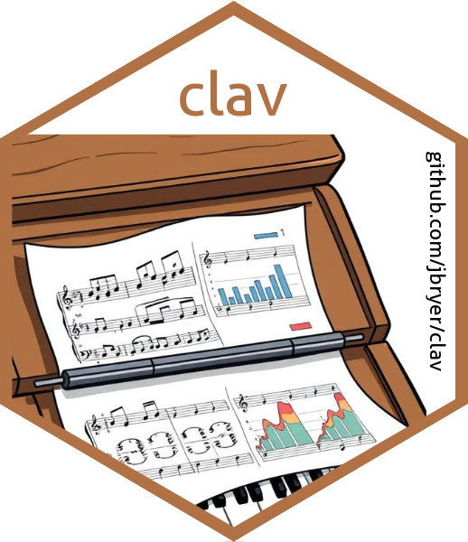
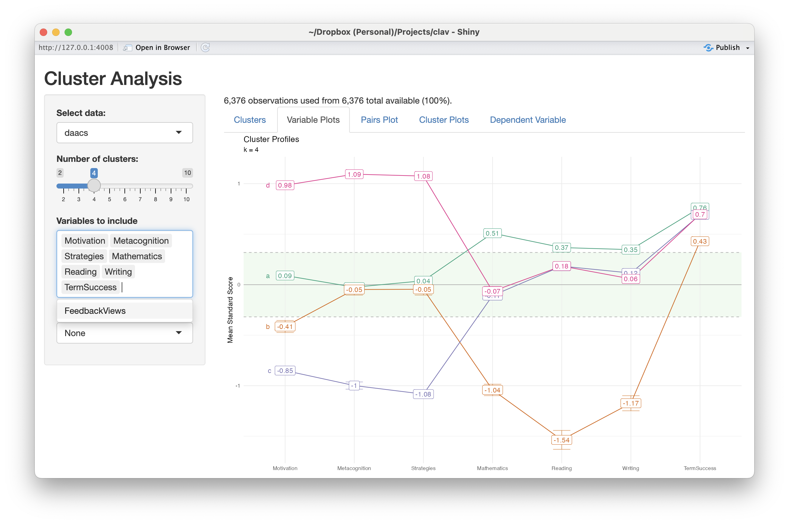

```{r generate-pdf, include=FALSE, eval=FALSE}
# This will generate a PDF of the slide deck.
pagedown::chrome_print(input = paste0(here::here(), '/slides/clav_jsm_2025.html'),
					   timeout = 120, 
					   format = 'pdf')
```

```{r setup, include = FALSE}
# Cartoons from https://github.com/allisonhorst/stats-illustrations
# dplyr based upon https://allisonhorst.shinyapps.io/dplyr-learnr/#section-welcome

library(rmarkdown)
library(knitr)
library(ggplot2)

knitr::opts_chunk$set(
  collapse = TRUE,
  warning = FALSE,
  message = FALSE,
  error = FALSE,
  comment = "#>",
  out.width = '100%',
  fig.height = 6,
  fig.width = 9
)

ggplot2::theme_set(ggplot2::theme_minimal())

# To use, add this to the slide title:   `r I(hexes(c("DATA606")))`
# It will use images in the images/hex_stickers directory (i.e. the filename is the parameter)
hexes <- function(x) {
	x <- rev(sort(x))
	markup <- function(pkg) glue::glue('')
	res <- purrr::map_chr(x, markup)
	paste0(res, collapse = "")
}

set.seed(2112)
```

class: center, middle, inverse, title-slide



# `r metadata$title`
## `r metadata$subtitle`
### `r metadata$author`
### `r metadata$date`


---
# Overview

1. Motivation for this package.

2. Discussion of validation in the context of clustering analysis.

3. How to use the `clav` package for clustering analysis.

	a. Determine the optimal number of clusters.
	
	b. Validation the cluster solution.
	
	c. Exploring the relationship of clusters to other variables.
	
4. Shiny application.


.font70[This research was supported under grants P116F150077 and R305A210269 from the U.S.
Department of Education. However, the contents do not necessarily represent the policy of the
U.S. Department of Education, and you should not assume endorsement by the Federal
Government.]


---
# Motivating Example

The Diagnostic Assessment and Achievement of College Skills (DAACS; [www.daacs.net](https://daacs.net)) is a suite of technological and social supports designed to optimize student learning. 

Students complete assessments in self-regulated learning, writing, mathematics, and reading comprehension. They are then provided with immediate feedback in terms of one, two, and three dots (developing, emerging, and mastering, respectively) and receive customized strategies and resources based upon their results.

Prior research has shown that DAACS can improve the accuracy of predicting student success by 2% to 10% over non-DAACS models. However, those models have been **variable centric**.

In order to provide better information to help institutional staff/instructors we wish to define **profiles** using a **person centric** approach.

---
# Data Source

Data for this study was collected as part of a large scale randomized control trial.

Online institution of predominately adult learners.

Competency based program where students complete a series of competencies that when combined form course credits.

Competencies are graded on pass/fail so success is measured by students completing the equivelent of 12 credits with 6 months.


---
# Validation

Model validation is the process of estimating how well a model performs. This is often done by separating the data into two where one dataset is used to train the model and predictions are made with the second dataset.

## Supervised Methods

*Supervised models* are models where the outcome, or *truth* is known. Common supervised methods include regression, classification, and object detection.

## Unsupervised Methods

*Unsupervised models* are models where the outcome is not observed or known. Common unsupervised methods include clustering (e.g. k-means, latent profile analysis) and dimension reduction (e.g. exploratory factor analysis, principal component analysis).


---
# Clustering

Clustering is a statistical procedure that groups observations that are similar across multiple variables. Whereas principal component analysis (PCA) and exploratory factor analysis (EFA) are variable centric (i.e. columns), clustering methods are observation centric (i.e. rows).

The `clav` package is designed to work with clustering algorithms. We will use k-means clustering here (using  `stats::kmeans()`), but other methods do work.

The steps for clustering include:

1. Determine the number of clusters.

2. Validate the cluster solution.

3. Use the cluster assignments in other models.

---
# Getting started

You can download the development version from Github:

```{r install-github, eval=FALSE}
remotes::install_github('jbryer/clav')
```

Load the package and data frame:

```{r datasetup}
library(clav)
data("daacs", package = "clav")
cluster_vars <- c('Motivation', 'Metacognition', 'Strategies', 'Mathematics', 'Reading', 'Writing')
outcome_vars <- c('FeedbackViews', 'TermSuccess')
```

We will standardize our clustering variables:

```{r standardize}
daacs <- daacs |> 
	dplyr::mutate(dplyr::across(dplyr::all_of(cluster_vars), clav::scale_this))
```


---
# DAACS Variables

.pull-left[
### Clustering Variables

Self-Regulated Learning measures (Likert response data ranging from 0 to 4)

* `Motivation`
* `Metacognition`
* `Strategies`

Academic measures (students complete 18 to 24 items, scores range from 0 to 1)

* `Mathematics`
* `Reading`
* `Writing`
]
.pull-right[
### Outcome Variables

* `FeedbackViews` - number of feedback pages students access within the DAACS system.
* `TermSuccess` - whether the student successfully completed 12 credits within their first term.

]

---
class: font80
# Variable Centric Approach

.pull-left[
```{r feedbackviews-regression, echo=FALSE}
lm(FeedbackViews ~ Motivation + Metacognition + Strategies + Mathematics + Reading + Writing,
	data = daacs) |> summary()
```
]

.pull-right[
```{r termsuccess-regression, echo=FALSE}
glm(TermSuccess ~ Motivation + Metacognition + Strategies + Mathematics + Reading + Writing,
	data = daacs, family = binomial(link = 'logit')) |> summary()
```
]

---
# Finding Optimal Clusters

Finding the optimal number of clusters is generally a balance between optimal fit statistics, parsimony, and interpretability. 

* [Davies-Bouldin Index](https://ieeexplore.ieee.org/document/4766909) (1979) - .font70[DBI is a metric used to evaluate the quality of a cluster analysis by measuring the compactness of clusters and their separation from each other. A lower DBI indicates better clustering, with well-separated and compact clusters.]
* [Calinski-Harabasz Statistic](https://www.tandfonline.com/doi/abs/10.1080/03610927408827101) (Caliński & Harabasz, 1974) - .font70[CH statistic measures the ratio of between-cluster variance to within-cluster variance, indicating how well-separated and compact the clusters are. Higher CH values generally indicate better clustering performance.]
* [Within group sum of squares](https://www.cambridge.org/core/journals/psychometrika/article/abs/who-belongs-in-the-family/5270D9B37A258A06C7CE7C0A528145F5) (Thorndike, 1953) - .font70[WSS quantifies the dispersion of data points within each cluster, with lower WSS values indicating more compact and well-defined clusters.]
* [Silhoutte score](https://www.sciencedirect.com/science/article/pii/0377042787901257?via%3Dihub) (Rousseeuw, 1986) - .font70[The silhouette value is a measure of how similar an object is to its own cluster (cohesion) compared to other clusters (separation). The silhouette value ranges from −1 to +1, where a high value indicates that the object is well matched to its own cluster and poorly matched to neighboring clusters.]
* [Gap statistic](https://academic.oup.com/jrsssb/article-abstract/63/2/411/7083348?redirectedFrom=fulltext&login=false) (Tibshirani, Walther, & Hastie, 2001) - .font70[The Gap statistic works by comparing the within-cluster variation of the actual data to that of a null reference distribution, typically a uniform distribution. The *gap* is the difference between these two, and the optimal number of clusters is chosen where the gap statistic is maximized.]
* [Rand index](https://www.tandfonline.com/doi/abs/10.1080/01621459.1971.10482356) (2012) - .font70[The Rand index measures how often pairs of data points are assigned to the same or different clusters in both partitions. A higher Rand Index indicates greater similarity between the two clusterings.]


---
# Finding Optimal Clusters (cont.)

The `optimal_clusters` function will estimate the fit statistics for varying number of clusters. The default (`max_k`) is 9, but set to 6 here to reduce execution time.

The `cluster_fun` parameter defaults to `stats::kmeans`, but can other clustering functions can be used.

```{r optimal-clusters, cache=TRUE}
optimal <- optimal_clusters(daacs[,cluster_vars], max_k = 6)
optimal
```

---
# Finding Optimal Clusters (cont.)

```{r optimal-clusters-plot, fig.height=3.7}
plot(optimal)
```

---
# Validating Clusters

For this example we are moving forward with a 5 cluster solution. The full details are available in [Cleary, Bryer, and Yu, 2025](https://github.com/daacs/Profile-Analysis).

Since there are no *known* clusters we cannot use methods typically used for supervised learning methods.

For cluster analysis, a valid cluster solution is one that is consistent.

Ullman et al (2021) proposed splitting the dataset and visually comparing the cluster solutions.

The `cluster_validation` implements this approach except that will split the dataset multiple times (default is 100). The clusters are estimated using the *training* data and cluster membership is predicted using that model with the *out-of-bag* (i.e. validation) sample.


---
# Validating Clusters

```{r cluster-validation, fig.height=4, cache=TRUE}
cv <- cluster_validation(df = daacs[,cluster_vars], n_clusters = 5)
plot(cv)
```


---
# Distribution of Cluster Means

```{r plot-distributions, fig.height=4}
plot_distributions(cv, plot_in_sample = TRUE, plot_oob_sample = TRUE)
```

---
# Bootstrapping

.pull-left[
Alternatively we can using bootstrapping instead of mutually exclusive splits.

Bootstrapping is a procedure where we sample from our sample with replacement. Each bootstrap sample then has the same *n* as the original dataset.

The *out-of-bag* sample are observations that were not randomly selected for the training data.

Bootstrapping may be preferable when sample sizes are smaller.
]

.pull-right[
To use bootstrapping:

* Set `sample_size` to the number of observations.
* Set `replace = TRUE`

```{r cluster-validation-bootstrap, fig.height=3, cache=TRUE}
cv_boot <- cluster_validation(
	daacs[,cluster_vars],
	n_clusters = 5,
	sample_size = nrow(daacs),
	replace = TRUE)
```
]

---
# Bootstrapping (cont.)


```{r cluster-validation-bootstrap-plot, fig.height=4.0}
plot(cv_boot)
```


---
# Retraining

.pull-left[
In the previous examples we predicted cluster membership from the model trained with the training data.

However, it is possible to compare the cluster solutions using two separate models: One trained with the training data and the other trained with out-of-bag (or validation) data.

]
.pull-right[
To use separate models for the two datasets, we need to define the `oob_predict_fun` parameter that implements cluster algorithm. In this example, we are wrapping the `stats::kmeans` function returning the cluster membership as a vector.

```{r retraining-validation, fig.height=3, cache=TRUE}
cv_retrain <- cluster_validation(
	daacs[,cluster_vars],
	n_clusters = 5,
	oob_predict_fun = function(fit, newdata) {
		stats::kmeans(newdata, 5)$cluster
	}
)
```
]


---
# Retraining (cont.)

```{r retraining-validation-plot, fig.height=4.0}
plot(cv_retrain)
```


---
# Profile Plots

```{r profile-plot, fig.height=4.0}
fit <- stats::kmeans(daacs[,cluster_vars], centers = 5)
profile_plot(daacs[,cluster_vars], clusters = fit$cluster, 
			 df_dep = daacs[,outcome_vars], cluster_order = cluster_vars)
```

---
# Shiny Application

```{r shiny-app, eval=FALSE}
clav::cluster_shiny(daacs = daacs) # NOTE: Can pass an arbitrary named parameters of data.frames
```

```{r shiny-app-screenshot, echo=FALSE, out.width="70%", fig.align='center'}

```

---
# Deploying Application with Your Data (`app.R`)

```{r, eval=FALSE}
library(clav)                                                     # Load packages

data("daacs", package = "clav")                                   # Load some data frames
data("pisa2015", package = "clav")
pisa_usa <- pisa2015 |> dplyr::filter(country == "UNITED STATES")
pisa_can <- pisa2015 |> dplyr::filter(country == "CANADA")

data_frames <- list(                                              # The data_frames list object
	"DAACS" = daacs,                                              # contains the data.frames.
	"PISA USA" = pisa_usa,                                        # The name is required and is
	"PISA Canada" = pisa_can                                      # what the user sees.
)

server <- clav::clav_shiny_server                                 # Copy the server and UI Shiny
ui <- clav::clav_shiny_ui                                         # functions from clav.

app_env <- new.env()                                              # Create a new empty environment.
assign("data_frames", data_frames, app_env)                       # Assign data_frames to app_env.

environment(server) <- as.environment(app_env)                    # Assigned the data_frames
environment(ui) <- as.environment(app_env)                        # object to the Shiny functions.

shiny::shinyApp(ui = ui, server = server)                         # Run the app
```


---
class: inverse, right, middle, hide-logo, font130

.pull-left[

```{r qrcode, echo=FALSE, out.width='90%', out.height='90%', fig.width=4, fig.height=4}
qrcode::qr_code('https://github.com/jbryer/clav', 'M') |> plot(col = c('#005DAC', 'white'))
```

]
.pull-right[
.font180[Thank you!]

[`r icons::fontawesome("paper-plane")` jason.bryer@cuny.edu](mailto:jason.bryer@cuny.edu)  
[`r icons::fontawesome("github")` @jbryer](https://github.com/jbryer)  
[`r icons::fontawesome('mastodon')` @jbryer@vis.social](https://vis.social/@jbryer)  
[`r icons::fontawesome("link")` github.com/jbryer/clav](https://github.com/jbryer/clav)   

]
