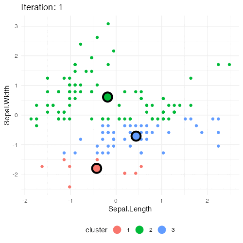
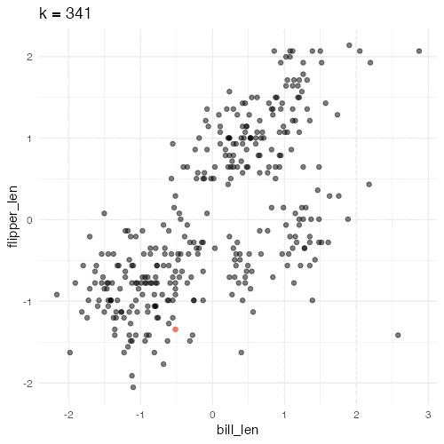
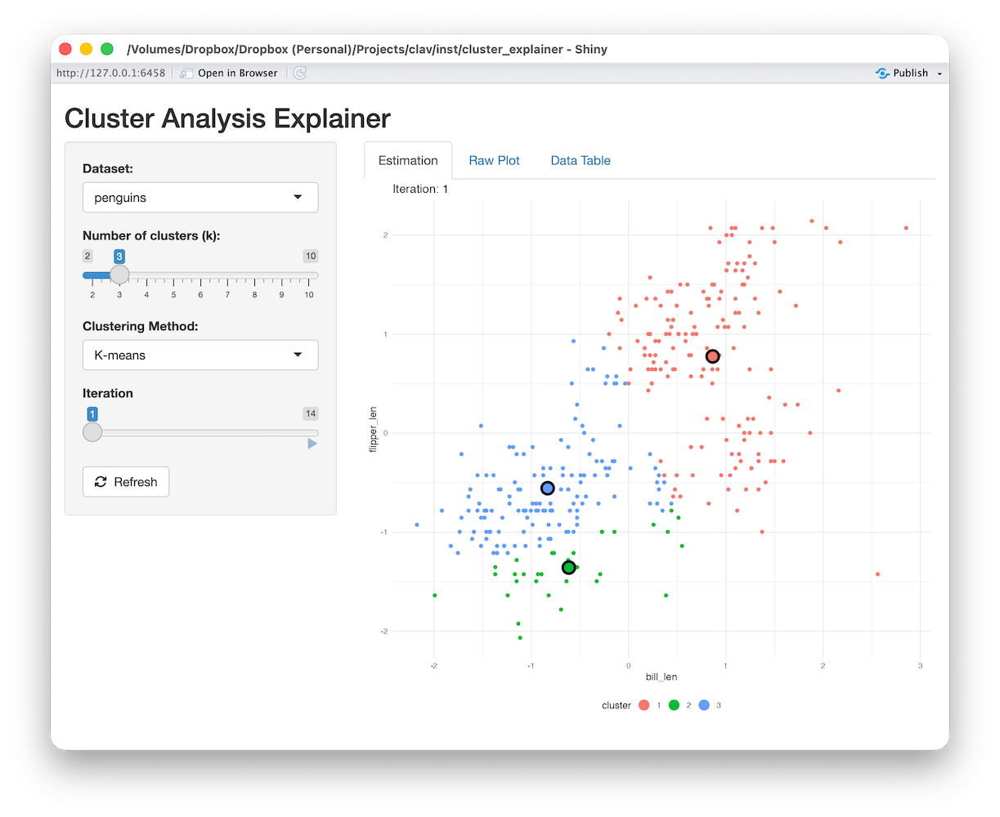
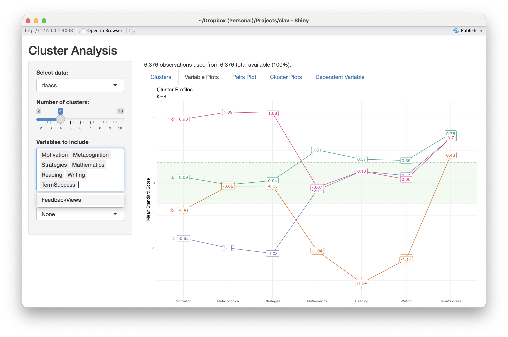

```{r generate-pdf, include=FALSE, eval=FALSE}
# This will generate a PDF of the slide deck.
pagedown::chrome_print(input = paste0('clav_nyhackr_2026.html'),
					   timeout = 120, 
					   format = 'pdf')
```

```{r setup, include = FALSE}
# Cartoons from https://github.com/allisonhorst/stats-illustrations
# dplyr based upon https://allisonhorst.shinyapps.io/dplyr-learnr/#section-welcome

library(rmarkdown)
library(knitr)
library(ggplot2)

knitr::opts_chunk$set(
  collapse = TRUE,
  warning = FALSE,
  message = FALSE,
  error = FALSE,
  comment = "#>",
  out.width = '100%',
  fig.height = 7,
  fig.width = 9,
  dpi = 240
)

ggplot2::theme_set(ggplot2::theme_minimal())

# To use, add this to the slide title:   `r I(hexes(c("DATA606")))`
# It will use images in the images/hex_stickers directory (i.e. the filename is the parameter)
hexes <- function(x) {
	x <- rev(sort(x))
	markup <- function(pkg) glue::glue('')
	res <- purrr::map_chr(x, markup)
	paste0(res, collapse = "")
}

set.seed(2112)
```

class: center, middle, inverse, title-slide


# `r metadata$title`
## `r metadata$subtitle`
### `r metadata$author`
### `r metadata$date`


---
# Overview

1. Motivation for this package.

2. Discussion of validation in the context of clustering analysis.

3. How to use the `clav` package for clustering analysis.

	a. Determine the optimal number of clusters.
	
	b. Validation the cluster solution.
	
	c. Exploring the relationship of clusters to other variables.
	
4. Shiny application.


.font70[This research was supported under grants P116F150077 and R305A210269 from the U.S.
Department of Education. However, the contents do not necessarily represent the policy of the
U.S. Department of Education, and you should not assume endorsement by the Federal
Government.]


---
class: font90
# Motivating Example

The Diagnostic Assessment and Achievement of College Skills (DAACS; [www.daacs.net](https://daacs.net)) is a suite of technological and social supports designed to optimize student learning. 

Students complete assessments in self-regulated learning, writing, mathematics, and reading comprehension. They are then provided with immediate feedback in terms of one, two, and three dots (developing, emerging, and mastering, respectively) and receive customized strategies and resources based upon their results.

Results from a large scale RCT suggest that DAACS can improve student success (Bryer et al, 2025, 2026)

Prior research has shown that DAACS can improve the accuracy of predicting student success by 2% to 10% over non-DAACS models. However, those models have been **variable centric**.

In order to provide better information to help institutional staff/instructors we wish to define **profiles** using a **person centric** approach.

---
# Data Source

Data for this study was collected as part of a large scale randomized control trial.

Online institution of predominately adult learners.

Competency based program where students complete a series of competencies that when combined form course credits.

Competencies are graded on pass/fail so success is measured by students completing the equivelent of 12 credits with 6 months.


---
# Validation

Model validation is the process of estimating how well a model performs. This is often done by separating the data into two where one dataset is used to train the model and predictions are made with the second dataset.

## Supervised Methods

*Supervised models* are models where the outcome, or *truth* is known. Common supervised methods include regression, classification, and object detection.

## Unsupervised Methods

*Unsupervised models* are models where the outcome is not observed or known. Common unsupervised methods include clustering (e.g. k-means, latent profile analysis) and dimension reduction (e.g. exploratory factor analysis, principal component analysis).


---
# Clustering

Clustering is a statistical procedure that groups observations that are similar across multiple variables. Whereas principal component analysis (PCA) and exploratory factor analysis (EFA) are variable centric (i.e. columns), clustering methods are observation centric (i.e. rows).

The `clav` package is designed to work with clustering algorithms. We will use k-means clustering (using `stats::kmeans()`) and hierarchical clustering (using `stats::hclust()`) here, but other methods do work.

The steps for clustering include:

1. Determine the number of clusters.

2. Validate the cluster solution.

3. Use the cluster assignments in other models.


---
# k-means clustering

.pull-left[
1. **Initialize centroids** - Randomly select k points (initial centroids)
2. **Assign clusters** - Assign each point to a cluster based upon which center is closest.
3. **Update centroids** - Calculate the mean for each cluster.
4. **Repeat** - Repeat steps 2 and 3 until the centroid doesn't change.

We need to know *k* ahead of time.

Goal is to minimize the within cluster sum-of-squares.

Works well clusters are spherical.
]
.pull-right[
```{r, echo=FALSE}

```
]


---
# Hierarchical Clustering

.pull-left[
1. Starts with each observation being its own cluster.
2. Calculate distance matrix (e.g. using Euclidean or Manhattan distances)
3. Combine clusters that are closest until there is one cluster.

```{r, echo=FALSE}
penguins_cluster_vars <- c('bill_len', 'flipper_len')
penguins <- penguins |>
	dplyr::select(species, bill_len, flipper_len) |>
	dplyr::filter(!is.na(bill_len) & 
				  !is.na(flipper_len)) |>
	dplyr::mutate(dplyr::across(
		dplyr::all_of(penguins_cluster_vars), 
		clav::scale_this))
hclust_out <- stats::hclust(stats::dist(penguins[,penguins_cluster_vars]))
plot(hclust_out, labels = FALSE)

# library(dendextend)
# dend_h <- heights_per_k.dendrogram(dend)
# par(mfrow = c(1,2))
# plot(dend)
# plot(dend, ylim = c(dend_h["3"], dend_h["1"]))
```
]
.pull-right[
```{r, echo=FALSE, fig.height=3}

```
]

---
# Shiny Application

```{r, eval=FALSE}
clav::cluster_explainer_shiny()
```

```{r, eval=TRUE, echo=FALSE, fig.align='center', out.width=600}

```

---
# Getting started with the `clav` package

You can download the development version from Github:

```{r install-github, eval=FALSE}
remotes::install_github('jbryer/clav')
```

Load the package and data frame:

```{r datasetup}
library(clav)
data("daacs", package = "clav")
daacs_cluster_vars <- c('Motivation', 'Metacognition', 'Strategies', 'Mathematics', 'Reading', 'Writing')
daacs_outcome_vars <- c('FeedbackViews', 'TermSuccess')
```

We will standardize our clustering variables:

```{r standardize}
daacs <- daacs |> 
	dplyr::mutate(dplyr::across(dplyr::all_of(daacs_cluster_vars), clav::scale_this))
```


---
# DAACS Variables

.pull-left[
### Clustering Variables

Self-Regulated Learning measures (Likert response data ranging from 0 to 4)

* `Motivation`
* `Metacognition`
* `Strategies`

Academic measures (students complete 18 to 24 items, scores range from 0 to 1)

* `Mathematics`
* `Reading`
* `Writing`
]
.pull-right[
### Outcome Variables

* `FeedbackViews` - number of feedback pages students access within the DAACS system.
* `TermSuccess` - whether the student successfully completed 12 credits within their first term.

]

---
class: font80
# Variable Centric Approach

.pull-left[
```{r feedbackviews-regression, echo=FALSE}
lm(FeedbackViews ~ Motivation + Metacognition + Strategies + Mathematics + Reading + Writing,
	data = daacs) |> summary()
```
]

.pull-right[
```{r termsuccess-regression, echo=FALSE}
glm(TermSuccess ~ Motivation + Metacognition + Strategies + Mathematics + Reading + Writing,
	data = daacs, family = binomial(link = 'logit')) |> summary()
```
]

---
# Finding Optimal Clusters

Finding the optimal number of clusters is generally a balance between optimal fit statistics, parsimony, and interpretability. 

* [Davies-Bouldin Index](https://ieeexplore.ieee.org/document/4766909) (1979) - .font70[DBI is a metric used to evaluate the quality of a cluster analysis by measuring the compactness of clusters and their separation from each other. A lower DBI indicates better clustering, with well-separated and compact clusters.]

--
* [Calinski-Harabasz Statistic](https://www.tandfonline.com/doi/abs/10.1080/03610927408827101) (Caliński & Harabasz, 1974) - .font70[CH statistic measures the ratio of between-cluster variance to within-cluster variance, indicating how well-separated and compact the clusters are. Higher CH values generally indicate better clustering performance.]

--
* [Within group sum of squares](https://www.cambridge.org/core/journals/psychometrika/article/abs/who-belongs-in-the-family/5270D9B37A258A06C7CE7C0A528145F5) (Thorndike, 1953) - .font70[WSS quantifies the dispersion of data points within each cluster, with lower WSS values indicating more compact and well-defined clusters.]

--
* [Silhoutte score](https://www.sciencedirect.com/science/article/pii/0377042787901257?via%3Dihub) (Rousseeuw, 1986) - .font70[The silhouette value is a measure of how similar an object is to its own cluster (cohesion) compared to other clusters (separation). The silhouette value ranges from −1 to +1, where a high value indicates that the object is well matched to its own cluster and poorly matched to neighboring clusters.]

--
* [Gap statistic](https://academic.oup.com/jrsssb/article-abstract/63/2/411/7083348?redirectedFrom=fulltext&login=false) (Tibshirani, Walther, & Hastie, 2001) - .font70[The Gap statistic works by comparing the within-cluster variation of the actual data to that of a null reference distribution, typically a uniform distribution. The *gap* is the difference between these two, and the optimal number of clusters is chosen where the gap statistic is maximized.]

--
* [Rand index](https://www.tandfonline.com/doi/abs/10.1080/01621459.1971.10482356) (2012) - .font70[The Rand index measures how often pairs of data points are assigned to the same or different clusters in both partitions. A higher Rand Index indicates greater similarity between the two clusterings.]


---
# Finding Optimal Clusters (cont.)

The `optimal_clusters` function will estimate the fit statistics for varying number of clusters. The default (`max_k`) is 9, but set to 6 here to reduce execution time.

The `cluster_fun` parameter defaults to `stats::kmeans`, but can other clustering functions can be used.

```{r optimal-clusters, cache=TRUE}
optimal <- clav::optimal_clusters(daacs[,daacs_cluster_vars], max_k = 6)
optimal
```

---
# Finding Optimal Clusters (cont.)

```{r optimal-clusters-plot, fig.height=3.7}
plot(optimal) |> print()
```

---
class: inverse, middle, center
# This is where I went down a rabit hole

---
# Let's explore where k is known

.pull-left[
**Palmer's Penguins**

.font80[Data on adult penguins covering three species found on three islands in the Palmer Archipelago, Antarctica, including their size (flipper length, body mass, bill dimensions), and sex.]

```{r}
data('penguins', package = 'datasets')

penguins_cluster_vars <- c('bill_len', 'flipper_len')
penguins_cluster_var <- 'species'

penguins <- penguins |>
	dplyr::select(species, bill_len, flipper_len) |>
	dplyr::filter(!is.na(bill_len) & 
				  !is.na(flipper_len)) |>
	dplyr::mutate(dplyr::across(
		dplyr::all_of(penguins_cluster_vars), 
		clav::scale_this))
```
]
.pull-right[
**Edgar Anderson's Iris Data**

.font80[This famous (Fisher's or Anderson's) iris data set gives the measurements in centimeters of the variables sepal length and width and petal length and width, respectively, for 50 flowers from each of 3 species of iris. The species are Iris setosa, versicolor, and virginica.]

```{r}
data('iris', package = 'datasets')

iris_cluster_vars <- c('Sepal.Width', 'Petal.Width')
iris_cluster_var <- 'Species'

iris <- iris |>
	dplyr::mutate(dplyr::across(
		dplyr::all_of(iris_cluster_vars), 
		clav::scale_this))
```
]

---
# Known clusters

.pull-left[
```{r, echo=FALSE}
ggplot(penguins, aes(x = bill_len, y = flipper_len, color = species)) +
	geom_point() +
	ggtitle("Palmer's Penguins")
```
]
.pull-right[
```{r, echo=FALSE}
ggplot(iris, aes(x = Sepal.Width, y = Petal.Width, color = Species)) +
	geom_jitter() +
	ggtitle("Edgar Anderson's Iris Data")
```
]


---
# Optimal Clusters (k-means)

.pull-left[
```{r, fig.height = 6}
penguins_kmeans_optimal <- clav::optimal_clusters(
	penguins[,penguins_cluster_vars],
	cluster_fun = stats::kmeans,
	max_k = 6)
plot(penguins_kmeans_optimal) |> print()

```
]
.pull-right[
```{r, fig.height = 6}
iris_kmeans_optimal <- clav::optimal_clusters(
	iris[,iris_cluster_vars],
	cluster_fun = stats::kmeans,
	max_k = 6)
plot(iris_kmeans_optimal) |> print()
```
]

---
# Optimal Clusters (hierarchical clustering)

.pull-left[
```{r, fig.height = 6}
penguins_kmeans_optimal <- clav::optimal_clusters(
	penguins[,penguins_cluster_vars],
	cluster_fun = clav::hclust2,
	max_k = 6)
plot(penguins_kmeans_optimal) |> print()

```
]
.pull-right[
```{r, fig.height = 6}
iris_kmeans_optimal <- clav::optimal_clusters(
	iris[,iris_cluster_vars],
	cluster_fun = clav::hclust2,
	max_k = 6)
plot(iris_kmeans_optimal) |> print()
```
]

---
# Optimal Clusters Summary

As we can see, the there is not much agreement using the six commonly used methods for determinging k.

```{r, echo=FALSE}
optimal_k <- readxl::read_excel('optimal_k.xlsx')
optimal_k |>
	huxtable::as_hux() |>
	huxtable::merge_cells(1, 2:3) |>
	huxtable::merge_cells(1, 4:5) |>
	huxtable::merge_cells(3, 2:3) |>
	huxtable::merge_cells(3, 4:5) |>
	huxtable::set_bold(row = nrow(optimal_k) + 1)
```


---
# Valdiation

Ullman et al (2021) proposed an approach to validating a cluster solution by visually inspecting the cluster solutions across a training and validation dataset. The following example demonstrates their approach using k-means with the `penguins` dataset.

```{r}
set.seed(2112); train_rows <- sample(nrow(penguins), nrow(penguins) / 2)
penguins_train <- penguins[train_rows,penguins_cluster_vars]
penguins_valid <- penguins[-train_rows,penguins_cluster_vars]
penguins_kmeans <- kmeans(penguins_train, 3)
penguins_train$cluster <- factor(predict(penguins_kmeans, newdata = penguins_train))
penguins_valid$cluster <- factor(predict(penguins_kmeans, newdata = penguins_valid))
```

---
# Valdiation (cont.)

.pull-left[
```{r, echo=FALSE}
ggplot(penguins_train, aes(x = bill_len, y = flipper_len, color = cluster)) + 
	geom_point() + geom_density2d()
```
]
.pull-right[
```{r, echo=FALSE}
ggplot(penguins_valid, aes(x = bill_len, y = flipper_len, color = cluster)) + 
	geom_point() + geom_density2d()
```
]


---
# Cluster Validation

Ullman et al (2021) approach is implemented in the `clav::cluster_validation()` function, except we are taking multiple random samples (50%) here.

.pull-left[
```{r}
penguins_kmeans_valid <- cluster_validation(
	df = penguins[,penguins_cluster_vars],
	n_clusters = 3,
	cluster_fun = stats::kmeans,
	sample_size = nrow(penguins) / 2,
	replace = FALSE
)
```

```{r, eval=FALSE}
plot(penguins_kmeans_valid)
```
]
.pull-right[
```{r, echo=FALSE}
plot(penguins_kmeans_valid)
```
]

---
# Distributions of cluster centers

```{r, fig.height=4}
clav::plot_distributions(penguins_kmeans_valid)
```

---
# Bootstrapping

Bootstrapping (Efron, 1979) is a method where we sample from our sample with replacement.

For each bootstrap sample approximately 63% of observations will be used leaving approximately 27% available for validation (often referred to as the out-of-bag sample).

For each bootstrap sample the clustering function will be called with the in-bag sample and then predictions made with the out-of-bag sample.

```{r}
penguins_kmeans_valid <- clav::cluster_validation(
	df = penguins[,penguins_cluster_vars],
	n_clusters = 3,
	cluster_fun = stats::kmeans,
	sample_size = nrow(penguins),  # n for each sample is equal to original data
	replace = TRUE                 # Sample with replacement
)
```

Note that `clav::cluster_validation()` uses bootstrapping by default.

---
# Implementation note

The `clav` package requires clustering functions have two parameters where the first is the data.frame and the second is k. There must also be an S3 generic function for `predict()` with a `newdata` parameter. The `kmeans` function fulfills these requirements, but `hclust` does not (note the `hclust2()` function is in the `clav` package).

.pull-left[
```{r, eval=FALSE}
hclust2 <- function(x, k, ...) {
	result <- stats::hclust(stats::dist(x), ...)
	result$k <- k
	result$data <- x
	result$cluster <- stats::cutree(result, k = k)
	class(result) <- c('hclust2', class(result))
	return(result)
}
```
]
.pull-right[
```{r, eval=FALSE}
predict.hclust2 <- function(
		object,
		newdata,
		...
) {
	if(missing(newdata)) { newdata <- object$data }
	clusters <- stats::cutree(object, k = object$k)
	centers <- clav::get_centers(object$data, clusters)
	ss_by_center <- apply(centers, 1, function(x) {
		colSums((t(newdata) - x) ^ 2)
	})
	apply(ss_by_center, 1, which.min)
}
```
]


---
# Cluster Overlap Fit

For each variable and cluster, the percent overlap between the bootstrap distribution of the means is calculated. We can either use the mean or median for all the combinations to report a COF for a particular k. Smaller values are desirable.

.pull-left[
```{r penguins_kmeans_cof, cache=TRUE}
penguins_kmeans_cof <- clav::cluster_overlap_fit(
	df = penguins[,penguins_cluster_vars],
	k = 2:6,
	cluster_fun = stats::kmeans)
```
]
.pull-right[
```{r penguins_hclust_cof, cache=TRUE}
penguins_hclust_cof <- clav::cluster_overlap_fit(
	df = penguins[,penguins_cluster_vars],
	k = 2:6,
	cluster_fun = clav::hclust2)
```
]

---
# Cluster Overlap Fit (`penguins`)

.pull-left[
```{r, fig.height=5}
plot(penguins_kmeans_cof)
```
]
.pull-right[
```{r, fig.height=5}
plot(penguins_hclust_cof)
```
]

---
# Cluster Overlap Fit (`iris`)

.pull-left[
```{r iris_kmeans_cof, cache=TRUE}
iris_kmeans_cof <- clav::cluster_overlap_fit(
	df = iris[,iris_cluster_vars],
	k = 2:6,
	cluster_fun = stats::kmeans)
```
```{r, fig.height=5}
plot(iris_kmeans_cof)
```
]
.pull-right[
```{r iris_hclust_cof, cache=TRUE}
iris_hclust_cof <- clav::cluster_overlap_fit(
	df = iris[,iris_cluster_vars],
	k = 2:6,
	cluster_fun = clav::hclust2)
```
```{r, fig.height=5}
plot(iris_hclust_cof)
```
]

---
# Cluster Agreement Fit

For each observation the percentage of agreement with all other observations across all models is estimated. The cluster agreement fit is the average across all those observations. Values of zero and one are desirable.

.pull-left[
```{r penguins_kmeans_caf, cache=TRUE}
penguins_kmeans_caf <- clav::cluster_agreement_fit(
	df = penguins[,penguins_cluster_vars],
	k = 2:6,
	cluster_fun = stats::kmeans)
```
```{r, fig.height=3}
plot(penguins_kmeans_caf) + ylim(c(0, 1)) + ggtitle('Penguins k-means')
```
]
.pull-right[
```{r penguins_hclust_caf, cache=TRUE}
penguins_hclust_caf <- clav::cluster_agreement_fit(
	df = penguins[,penguins_cluster_vars],
	k = 2:6,
	cluster_fun = clav::hclust2)
```
```{r, fig.height=3}
plot(penguins_hclust_caf) + ylim(c(0, 1)) + ggtitle('Penguins Hierarchical Clustering')
```
]

---
# Cluster Agreement Fit Histogram (`penguins`)

.pull-left[
```{r}
hist(penguins_kmeans_caf) + ggtitle('Penguins k-means')
```
]
.pull-right[
```{r}
hist(penguins_hclust_caf) + ggtitle('Penguins Hierarchical Clustering')
```
]

---
# Cluster Agreement Fit (`iris`)

.pull-left[
```{r iris_kmeans_caf, cache=TRUE}
iris_kmeans_caf <- clav::cluster_agreement_fit(
	df = iris[,iris_cluster_vars],
	k = 2:6,
	cluster_fun = stats::kmeans)
```
```{r, fig.height=3}
plot(iris_kmeans_caf) + ylim(c(0, 1)) + ggtitle('Iris k-means')
```
]
.pull-right[
```{r iris_hclust_caf, cache=TRUE}
iris_hclust_caf <- clav::cluster_agreement_fit(
	df = iris[,iris_cluster_vars],
	k = 2:6,
	cluster_fun = clav::hclust2)
```
```{r, fig.height=3}
plot(iris_hclust_caf) + ylim(c(0, 1)) + ggtitle('Iris Hierarchical Clustering')
```
]

---
# Cluster Agreement Fit Histogram (`iris`)

.pull-left[
```{r}
hist(iris_kmeans_caf) + ggtitle('Iris k-means')
```
]
.pull-right[
```{r}
hist(iris_hclust_caf) + ggtitle('Iris Hierarchical Clustering')
```
]


---
class: inverse, middle, center
# Returning to DAACS


---
# Cluster Overlap Fit

```{r daacs_cof, cache=TRUE}
daacs_cof <- clav::cluster_overlap_fit(
	df = daacs[,daacs_cluster_vars], k = 2:6,
	cluster_fun = stats::kmeans)
```

```{r, fig.height=3}
plot(daacs_cof) + ggtitle('DAACS Cluster Overlap Fit', subtitle = 'k-means')
```

---
# Cluster Agreement Fit

```{r, daacs_caf, cache=TRUE}
daacs_caf <- clav::cluster_agreement_fit(
	df = daacs[,daacs_cluster_vars], k = 2:6,
	cluster_fun = stats::kmeans)
```

```{r, fig.height=3}
plot(daacs_caf) + ylim(c(0, 1)) + ggtitle('DAACS Cluster Agreement Fit', subtitle = 'k-means')
```

---
# Validating Clusters

For this example we are moving forward with a 5 cluster solution. The full details are available in [Cleary, Bryer, and Yu, 2025](https://github.com/daacs/Profile-Analysis). For cluster analysis, a valid cluster solution is one that is consistent.

```{r cluster-validation, cache=TRUE}
cv <- cluster_validation(df = daacs[,daacs_cluster_vars], n_clusters = 5)
```

```{r, fig.height=3}
plot(cv)
```

---
# Distribution of Cluster Means

```{r plot-distributions, fig.height=4}
plot_distributions(cv, plot_in_sample = TRUE, plot_oob_sample = TRUE)
```

---
# Retraining

.pull-left[
In the previous examples we predicted cluster membership from the model trained with the training data.

However, it is possible to compare the cluster solutions using two separate models: One trained with the training data and the other trained with out-of-bag (or validation) data.

]
.pull-right[
To use separate models for the two datasets, we need to define the `oob_predict_fun` parameter that implements cluster algorithm. In this example, we are wrapping the `stats::kmeans` function returning the cluster membership as a vector.

```{r retraining-validation, fig.height=3, cache=TRUE}
cv_retrain <- cluster_validation(
	daacs[,daacs_cluster_vars],
	n_clusters = 5,
	oob_predict_fun = function(fit, newdata) {
		stats::kmeans(newdata, 5)$cluster
	}
)
```
]


---
# Retraining (cont.)

```{r retraining-validation-plot, fig.height=4.0}
plot(cv_retrain)
```


---
# Profile Plots

```{r profile-plot, fig.height=4.0}
fit <- stats::kmeans(daacs[,daacs_cluster_vars], centers = 5)
profile_plot(daacs[,daacs_cluster_vars], clusters = fit$cluster, 
			 df_dep = daacs[,daacs_outcome_vars], cluster_order = daacs_cluster_vars)
```

---
# Shiny Application

```{r shiny-app, eval=FALSE}
clav::cluster_shiny(daacs = daacs) # NOTE: Can pass an arbitrary named parameters of data.frames
```

```{r shiny-app-screenshot, echo=FALSE, out.width="70%", fig.align='center'}

```

---
# Deploying Application with Your Data (`app.R`)

```{r, eval=FALSE}
library(clav)                                                     # Load packages

data("daacs", package = "clav")                                   # Load some data frames
data("pisa2015", package = "clav")
pisa_usa <- pisa2015 |> dplyr::filter(country == "UNITED STATES")
pisa_can <- pisa2015 |> dplyr::filter(country == "CANADA")

data_frames <- list(                                              # The data_frames list object
	"DAACS" = daacs,                                              # contains the data.frames.
	"PISA USA" = pisa_usa,                                        # The name is required and is
	"PISA Canada" = pisa_can                                      # what the user sees.
)

server <- clav::clav_shiny_server                                 # Copy the server and UI Shiny
ui <- clav::clav_shiny_ui                                         # functions from clav.

app_env <- new.env()                                              # Create a new empty environment.
assign("data_frames", data_frames, app_env)                       # Assign data_frames to app_env.

environment(server) <- as.environment(app_env)                    # Assigned the data_frames
environment(ui) <- as.environment(app_env)                        # object to the Shiny functions.

shiny::shinyApp(ui = ui, server = server)                         # Run the app
```


---
class: inverse, right, middle, hide-logo, font130

.left-column[

```{r qrcode, echo=FALSE, out.width='100%', out.height='100%', fig.width=4, fig.height=4}
qrcode::qr_code('https://github.com/jbryer/clav', 'M') |> plot(col = c('#005DAC', 'white'))
```

]

.font180[Thank you!]

[`r icons::fontawesome("paper-plane")` jason.bryer@cuny.edu](mailto:jason.bryer@cuny.edu)  
[`r icons::fontawesome("github")` @jbryer](https://github.com/jbryer)  
[`r icons::fontawesome('mastodon')` @jbryer@vis.social](https://vis.social/@jbryer)  
[`r icons::fontawesome("link")` github.com/jbryer/clav](https://github.com/jbryer/clav)   

